## Banca Examinadora {.smaller-text}

::: {.columns}
::: {.column width="70%"}
### Orientação

**Prof. Dr. XXXXXX**
Orientador – PPGPI/UFS

**Prof. Dr. Luiz Diego Vidal Santos**
Coorientador – PPGPI/UFS
:::

::: {.column width="30%"}
### Membros da Banca

*(A definir)*
:::
:::

::: {.info-box}
**CEP - CAAE:** 23853219.4.0000.5546
:::

---

## Estrutura da Apresentação {.smaller-text}

::: {.columns}
::: {.column width="50%"}
### Roteiro

- [1]{.circle} Introdução e Motivação
- [2]{.circle} Referencial Teórico
- [3]{.circle} Objetivos e Hipóteses
- [4]{.circle} Metodologia Geral
- [5]{.circle} Capítulos: Contexto e Métodos
- [6]{.circle} Resultados Parciais
- [7]{.circle} Síntese e Contribuições
:::

::: {.column width="50%"}
::: {.info-box}
**Tese organizada em 5 artigos**

Cada capítulo corresponde a uma etapa sequencial e interdependente do modelo computacional de salvaguarda.
:::
:::
:::

---

## [Introdução e Motivação]{.section-header}

---

## Saberes e Sistemas Agrícolas Tradicionais (SSAT) {.smaller-text}

::: {.columns}
::: {.column width="50%"}
### Conceito Fundamental

**Sistemas complexos ecossistêmicos antropogênicos**

- Co-evolução milenar entre grupos humanos e biomas
- **Conhecimento-Prática-Crença (K-P-B)** (Berkes, 2012)

::: {.info-box}
**Componentes**

- Policultura e agrofloresta
- Diversidade funcional e redundância biológica
- Serviços ecossistêmicos quantificáveis
- Identidades territoriais
:::
:::

::: {.column width="50%"}
### SSAT como Ativos Estratégicos

**Resource-Based View** (Barney, 1991)

Critérios **VRIN**:
- **V**aliosos
- **R**aros
- **I**nimitáveis
- **N**ão-substituíveis

::: {.highlight-box}
**Natureza do conhecimento**

- **Tácito** (Polanyi): transmissão oral, *learning-by-doing*
- **Invisível** às métricas da ciência hegemônica
- Necessidade de "externalização" (Nonaka)
:::
:::
:::

---

## O Problema Central {.smaller-text}

::: {.columns}
::: {.column width="55%"}
### Assimetria Informacional

**Detentores de saberes tradicionais** vs. **Agentes econômicos**

- SSAT são **subprecificados** e vulneráveis à apropriação indevida
- **Invisibilidade documentária** perante órgãos regulatórios
:::

::: {.column width="45%"}
::: {.highlight-box}
**Fricções Institucionais**

- Ausência de mecanismos formais de mensuração
- Custos de transação elevados para *compliance*
- Esgotamento de métodos lineares de elicitação
- Lacuna na conversão conhecimento tácito → parâmetros mensuráveis
:::
:::
:::

::: {.highlight-box}
**Lacuna Científica:** Inexiste modelo computacional plenamente integrado (Machine Learning, inferência fuzzy e modelagem psicométrica) capaz de transformar dados bioculturais em dossiês juridicamente válidos para a salvaguarda de SSAT como ativos intangíveis.
:::

---

## [Referencial Teórico]{.section-header}

---

## Pilares Teóricos {.smaller-text}

::: {.columns}
::: {.column width="50%"}
### Desenvolvimento Rural e PCTs

- **Abordagem Seniana:** desenvolvimento como liberdade
- Decreto nº 6.040/07 – Política Nacional para PCTs
- Conhecimentos etnoecológicos e etnopedológicos

::: {.info-box}
**Frame legislativo**

- Lei nº 9.985/2000 (SNUC)
- Lei nº 13.123/2015 (Patrimônio Genético)
- Lacuna: ausência de registro formal de CT
:::
:::

::: {.column width="50%"}
### Valoração de Ativos Intangíveis

- **RBV:** conhecimento como vantagem competitiva (Barney, 1991)
- **Capital Intelectual:** humano, estrutural, relacional
- Tácito vs. explícito (Polanyi → Nonaka)

### ML e Gestão da Inovação

- Modelagem de interações complexas em SAT
- Inovação como "novas combinações" (Schumpeter)
- Capacidades dinâmicas (Teece): *sensing → seizing → transforming*
:::
:::

---

## [Objetivos e Hipóteses]{.section-header}

---

## Objetivo Geral {.smaller-text}

::: {.highlight-box}
Desenvolver e validar modelo integrado de decodificação e salvaguarda, articulando Machine Learning, lógica fuzzy e modelagem psicométrica, para documentar e proteger ativos intangíveis em Saberes e Sistemas Agrícolas Tradicionais de comunidades quilombolas do Semiárido Nordeste II.
:::

### Objetivos Específicos

::: {.columns}
::: {.column width="50%"}
| OE | Descrição |
|----|-----------|
| OE1 | Mapear estado da arte em ML para SAT (Revisão PRISMA-ScR) |
| OE2 | Meta-análise das 8 dimensões de vulnerabilidade biocultural |
| OE3 | Converter saberes tácitos em variáveis computacionais (WOCAT + Delphi) |
:::

::: {.column width="50%"}
| OE | Descrição |
|----|-----------|
| OE4 | Desenvolver ISB via TRI-Fuzzy |
| OE5 | Avaliar auditoria normativa computacional (BN + NLP + DLT) |
| OE6 | Validar adoção territorial via design participativo |
:::
:::

---

## Questões e Hipóteses de Pesquisa {.smaller-text}

::: {.columns}
::: {.column width="50%"}
### Questões (Q1–Q6)

| Q | Foco |
|---|------|
| Q1 | Prontidão operacional do ML para SAT? |
| Q2 | As 8 dimensões diferem em magnitude de efeito? |
| Q3 | WOCAT-SLM + Delphi produzem consenso superior? |
| Q4 | ISB fuzzy+TRI tem maior concordância comunitária? |
| Q5 | Auditoria computacional verifica conformidade? |
| Q6 | Design participativo eleva adoção? |
:::

::: {.column width="50%"}
### Hipóteses (H1–H6)

| H | Proposição |
|---|-----------|
| H1 | ML insuficiente por lacunas em governança de dados |
| H2 | Pelo menos uma dimensão difere significativamente |
| H3 | WOCAT + Delphi produz consenso superior |
| H4 | ISB fuzzy+TRI tem maior concordância comunitária |
| H5 | Dossiês auditados têm padronização superior |
| H6 | Design participativo eleva adoção continuada |
:::
:::

---

## Fluxograma: Objetivos, Questões e Hipóteses {.smaller-text}

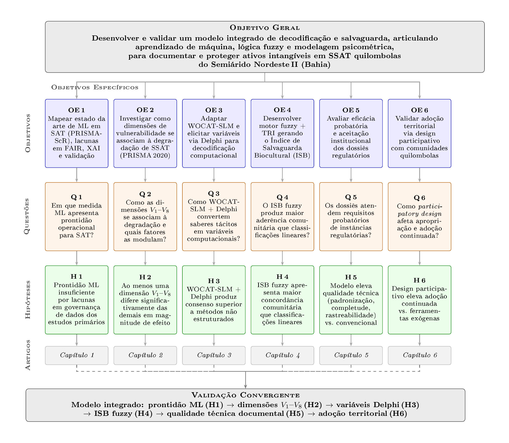{width="90%" fig-align="center"}

---

## [Metodologia]{.section-header}

---

## Arquitetura Metodológica em Y Convergente {.smaller-text}

{fig-align="center" width="95%"}

---

## Cap. 1 – Revisão de Escopo {.smaller-text}

::: {.columns}
::: {.column width="50%"}
### Contexto

- ML em expansão em sistemas agrícolas (Deep Learning: 4,8% → 21,1%)
- Aplicações em classificação de solo, predição de safra, detecção de pragas
- Lacuna: prontidão para **uso regulatório** em SAT não avaliada
:::

::: {.column width="50%"}
### Questão e Hipótese

::: {.info-box}
**Q1:** O ML tem prontidão operacional para aplicações regulatórias em SAT?
:::

::: {.highlight-box}
**H1:** Prontidão insuficiente por lacunas em governança de dados
:::
:::
:::

---

## Cap. 1 – Métodos {.smaller-text}

::: {.columns}
::: {.column width="45%"}
### Revisão PRISMA-ScR

- **244 estudos** (2010–2025)
- Bases: Scopus + Web of Science
- Precisão automatizada: 94,2%
- Validação manual: CCI = 0,87

### Análise

- Meta-regressão de acurácia
- Avaliação de conformidade FAIR
- Teste de viés de publicação (Egger)
- Análise de heterogeneidade (I²)
:::

::: {.column width="55%"}
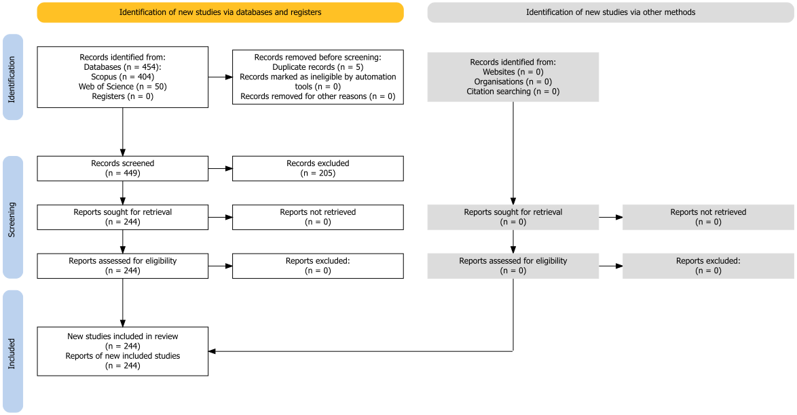{fig-align="center" width="100%"}
:::
:::

---

## Cap. 2 – Meta-análise {.smaller-text}

::: {.columns}
::: {.column width="50%"}
### Contexto

- Vulnerabilidade biocultural é multidimensional (V₁–V₈)
- Evidências dispersas em 8 dimensões distintas
- Necessário quantificar magnitudes de efeito para priorização de ações
:::

::: {.column width="50%"}
### Questão e Hipótese

::: {.info-box}
**Q2:** As 8 dimensões diferem em magnitude de efeito?
:::

::: {.highlight-box}
**H2:** Pelo menos uma dimensão difere significativamente
:::
:::
:::

---

## Cap. 2 – Métodos {.smaller-text}

::: {.columns}
::: {.column width="40%"}
### Desenho

- Meta-análise hierárquica 3 níveis
- Estimador: REML + RVE-CR2
- Métrica: lnRR (log do risco relativo)

### Amostra

- 365 registros → **47 estudos finais**
- 363 observações codificadas
- Moderadores: região, tipo de território, sistema de governança
:::

::: {.column width="60%"}
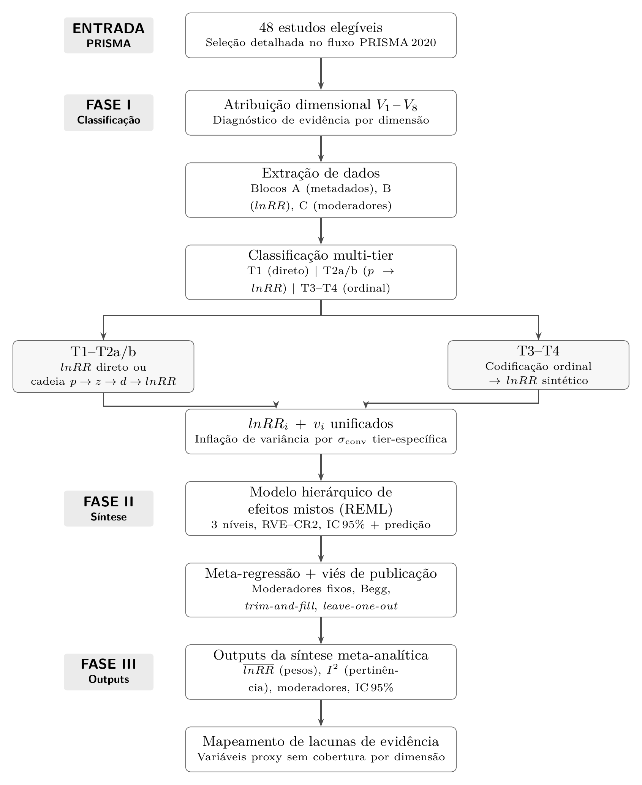{fig-align="center" width="100%"}
:::
:::

---

## Cap. 3 – Adaptação Transcultural + Delphi {.smaller-text}

::: {.columns}
::: {.column width="50%"}
### Contexto

- WOCAT-SLM: referência mundial para documentação de práticas de manejo sustentável da terra
- Não adaptado para comunidades quilombolas brasileiras
- Necessidade de dupla legitimidade: técnica + cultural
:::

::: {.column width="50%"}
### Questão e Hipótese

::: {.info-box}
**Q3:** WOCAT-SLM + Delphi produzem variáveis com consenso superior?
:::

::: {.highlight-box}
**H3:** WOCAT + Delphi produz consenso estatístico superior
:::
:::
:::

---

## Cap. 3 – Métodos {.smaller-text}

::: {.columns}
::: {.column width="42%"}
### Adaptação Transcultural (Beaton)

- 6 etapas · Comitê: especialistas + mestres quilombolas
- IVC ≥ 0,90 · Kappa ≥ 0,75
- Pré-teste: 10–15 agricultores

### Elicitação Delphi

- 15–25 especialistas · 3 rodadas
- W Kendall ≥ 0,70 · CVC ≥ 0,80
:::

::: {.column width="58%"}
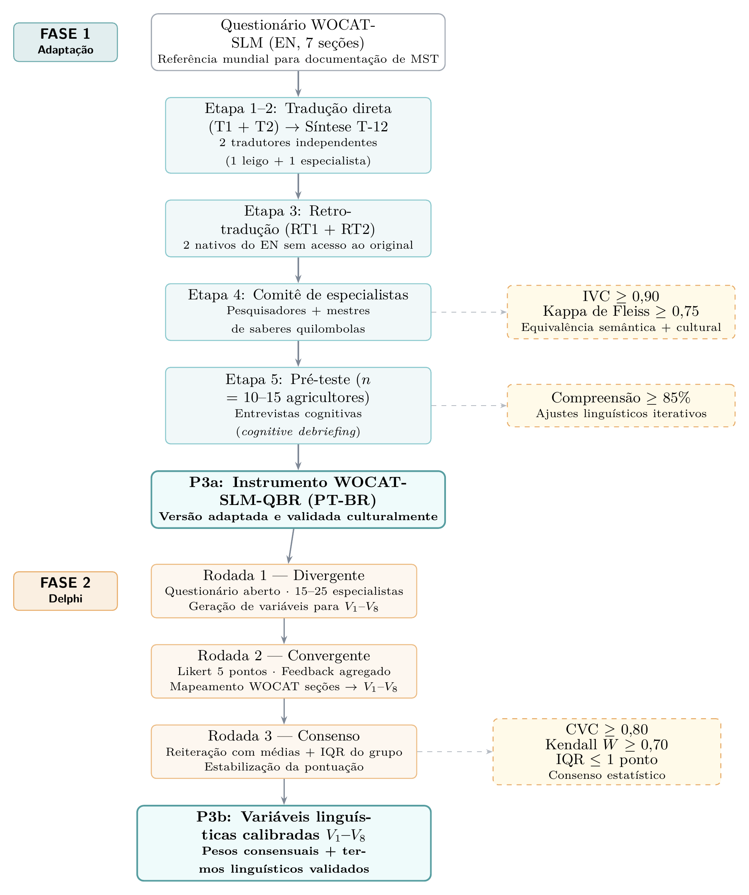{fig-align="center" width="100%"}
:::
:::

---

## Cap. 3 – Área de Estudo {.smaller-text}

::: {.columns}
::: {.column width="45%"}
### Território Semiárido Nordeste II – Bahia

- **11 comunidades quilombolas** – Jeremoabo (BA)
- Semiárido baiano · Caatinga
- Agricultura familiar de sequeiro
- Práticas tradicionais de manejo sustentável da terra (MST)
- Saberes ancestrais transmitidos entre gerações
:::

::: {.column width="55%"}
{fig-align="center" width="100%"}
:::
:::

---

## Cap. 4 – Índice ISB {.smaller-text}

::: {.columns}
::: {.column width="50%"}
### Contexto

- Necessidade de índice único integrando as 8 dimensões (V₁–V₈)
- Métodos lineares não capturam a não-linearidade das interações
- TRI + Fuzzy: calibração psicométrica + inferência com incerteza
:::

::: {.column width="50%"}
### Questão e Hipótese

::: {.info-box}
**Q4:** ISB via fuzzy+TRI tem maior concordância com percepção comunitária?
:::

::: {.highlight-box}
**H4:** ISB (fuzzy+TRI) tem maior concordância comunitária que métodos lineares
:::
:::
:::

---

## Cap. 4 – Métodos {.smaller-text}

::: {.columns}
::: {.column width="40%"}
### Componente 1: TRI

- Crédito Parcial (Masters)
- n = 30–40 respondentes
- Limiares δᵢₖ → escores θₙ

### Componente 2: Fuzzy

- Mamdani (trimf/trapmf)
- 50–100 regras SE-ENTÃO
- ISB: 0–100 (5 níveis)
:::

::: {.column width="60%"}
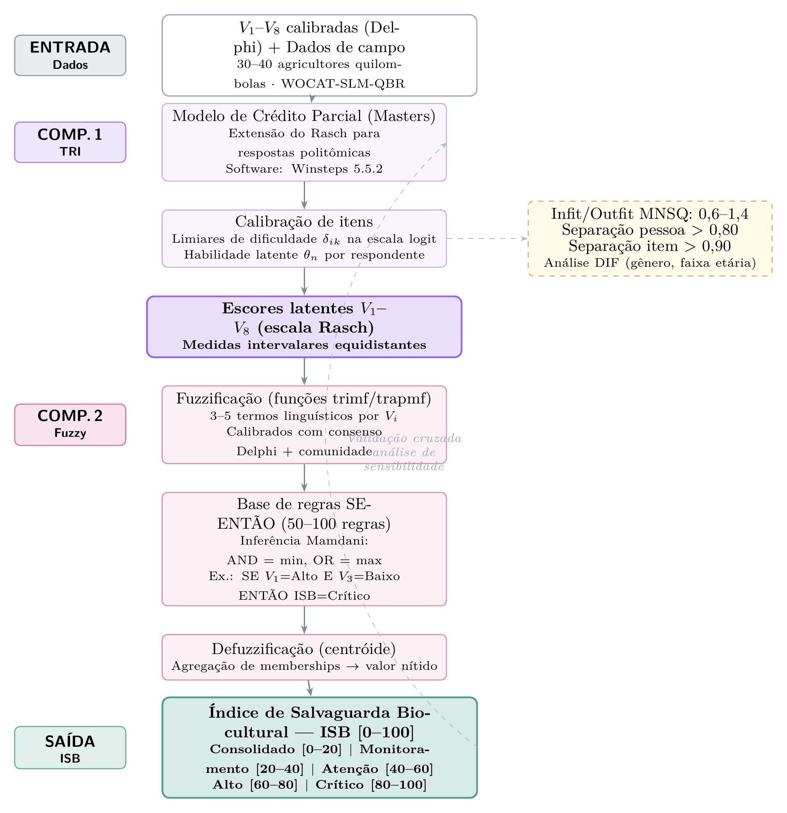{fig-align="center" width="100%"}
:::
:::

---

## Cap. 5 – Auditoria Computacional {.smaller-text}

::: {.columns}
::: {.column width="50%"}
### Contexto

- Dossiês exigem conformidade com IPHAN, INPI, CGen e FAO
- Verificação manual: lenta, subjetiva, não rastreável
- Auditoria automatizada e criptograficamente ancorada
:::

::: {.column width="50%"}
### Questão e Hipótese

::: {.info-box}
**Q5:** Auditoria computacional verifica conformidade automaticamente?
:::

::: {.highlight-box}
**H5:** Dossiês auditados têm padronização e rastreabilidade superiores
:::
:::
:::

---

## Cap. 5 – Métodos {.smaller-text}

::: {.columns}
::: {.column width="38%"}
### 3 Módulos Integrados

- **Mód. 1 – Bayesiano:** conformidade estrutural
- **Mód. 2 – SBERT:** verificação semântica
- **Mód. 3 – DLT:** ancoragem criptográfica

### Instâncias

IPHAN · INPI · CGen · FAO-GIAHS
:::

::: {.column width="62%"}
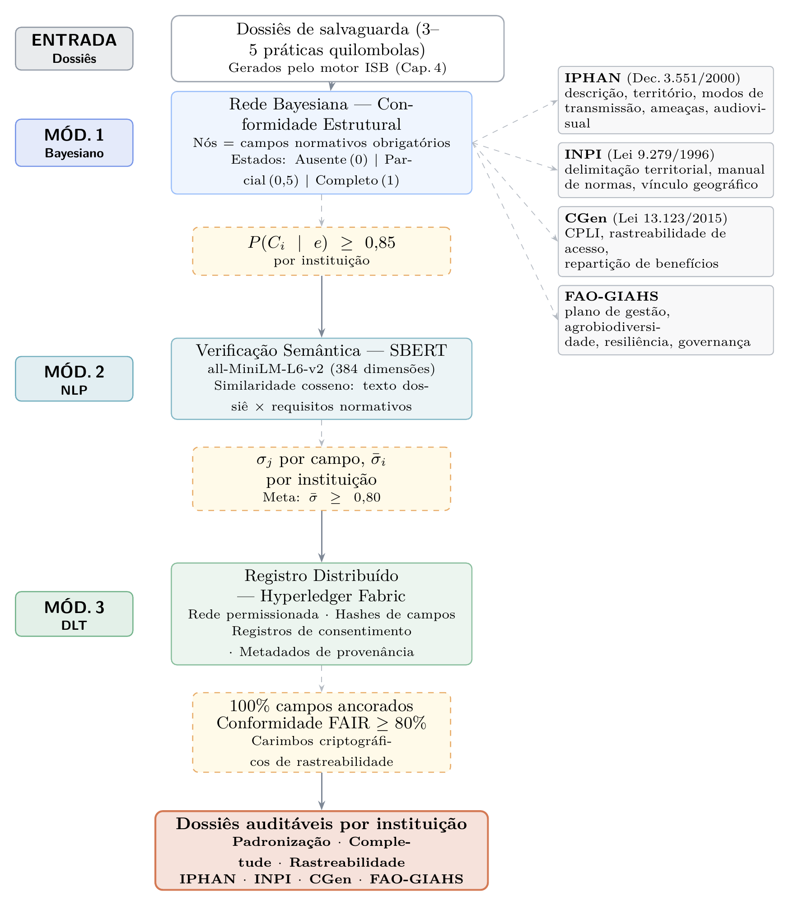{fig-align="center" width="100%"}
:::
:::

---

## Cap. 6 – Design Participativo {.smaller-text}

::: {.columns}
::: {.column width="50%"}
### Contexto

- ISB precisa de validação territorial
- Usabilidade e adoção: críticas para sustentabilidade
- Co-design garante legitimidade comunitária

::: {.info-box}
**Q6:** Design participativo eleva adoção continuada?
:::

::: {.highlight-box}
**H6:** Design participativo eleva adoção continuada
:::
:::

::: {.column width="50%"}
### 5 Fases

1. Diagnóstico participativo (grupos focais)
2. Co-design de regras e interfaces
3. Prototipagem + usabilidade (SUS ≥ 70)
4. Implantação piloto + capacitação
5. Avaliação de adoção (6–12 meses)
:::
:::

---

## Cap. 6 – Métodos (Em consideração) {.smaller-text}

::: {.columns}
::: {.column width="38%"}
### Desenho

- 2–3 comunidades quilombolas
- Protótipo Python/Streamlit
- 10–15 usuários · think-aloud

### Metas

- Sucesso ≥ 85%
- Adoção ≥ 60%
- Impacto percebido ≥ 70%
:::

::: {.column width="62%"}
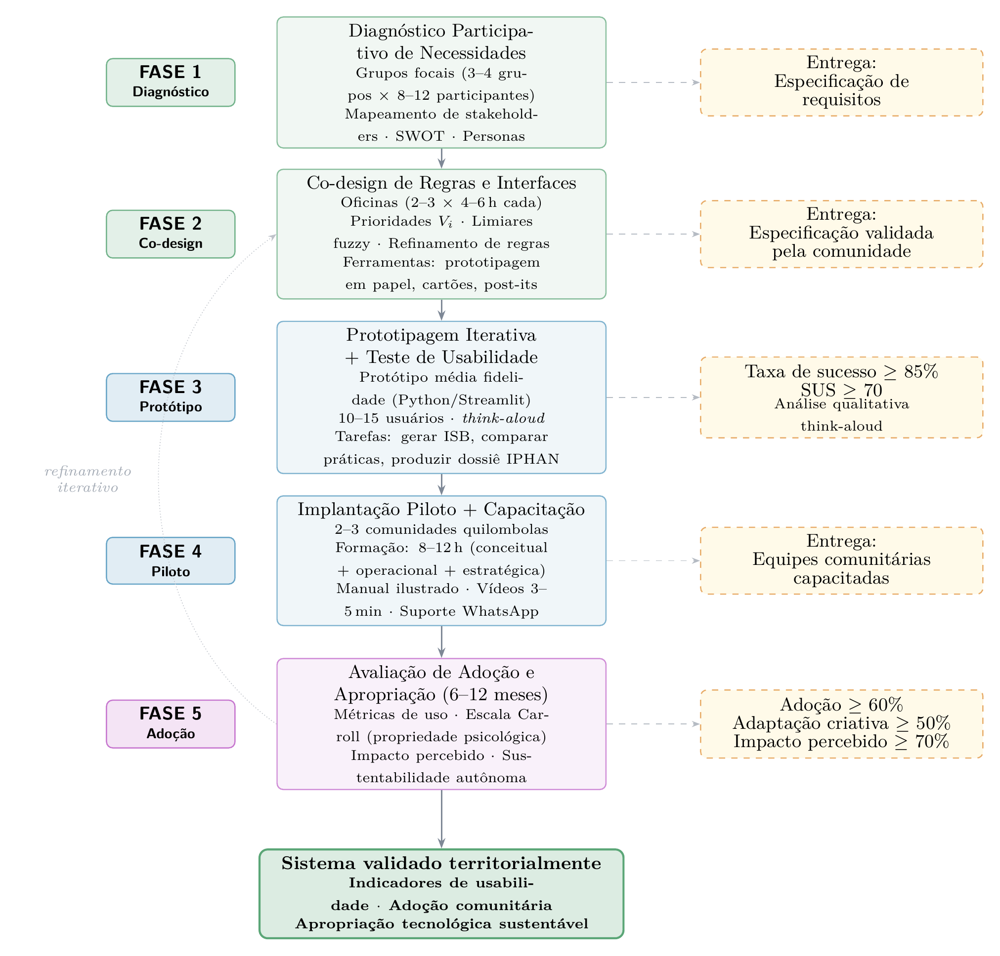{fig-align="center" width="100%"}
:::
:::

---

## [RESULTADOS PARCIAIS]{.section-header}

---

## Panorama das Hipóteses {.smaller-text}

| Hip. | Descrição | Status |
|------|-----------|--------|
| **1ª** | ML insuficiente por lacunas em governança | ✅ FAIR: 18,7/100 |
| **2ª** | Pelo menos uma dimensão difere em magnitude | ✅ V₄: −24,3%; V₈: +32,3% |
| **3ª** | WOCAT + Delphi produz consenso superior | ⏳ CVC validado – pré-teste pendente |
| **4ª** | ISB fuzzy+TRI com maior concordância | ⏳ *A testar* |
| **5ª** | Dossiês auditados com padronização superior | ⏳ *A testar* |
| **6ª** | Design participativo eleva adoção | ⏳ *A testar* |

::: {.info-box}
Slides a seguir detalham os resultados dos **Caps. 1–3** (✅) e o desenho proposto dos **Caps. 4–5** (⏳).
:::

---

## Cap. 1 – Resultados: Síntese Meta-analítica {.smaller-text}

::: {.columns}
::: {.column width="40%"}
### Métricas Principais

| Indicador | Valor |
|-----------|-------|
| Acurácia corrigida | **89,1%** |
| IC 95% | 88,2–90,0% |
| Heterogeneidade I² | 58% |
| Viés (Egger) | p = 0,009 |

::: {.highlight-box}
**244 estudos** analisados (2010–2025). Acurácia elevada, mas heterogeneidade moderada e viés de publicação significativo.
:::
:::

::: {.column width="60%"}
{fig-align="center" width="100%"}
:::
:::

---

## Cap. 1 – Resultados: Governança FAIR e Estrutura do Campo {.smaller-text}

::: {.columns}
::: {.column width="50%"}
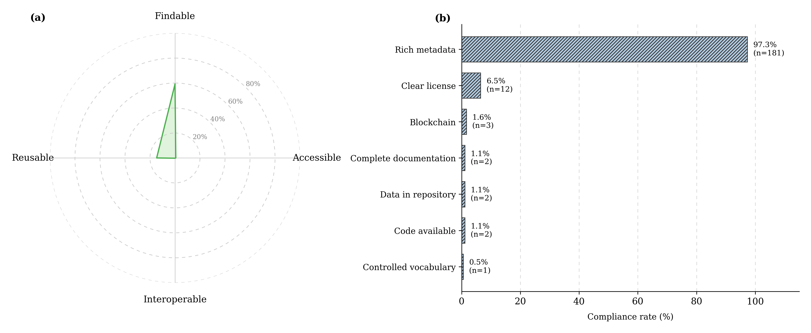{fig-align="center" width="100%"}

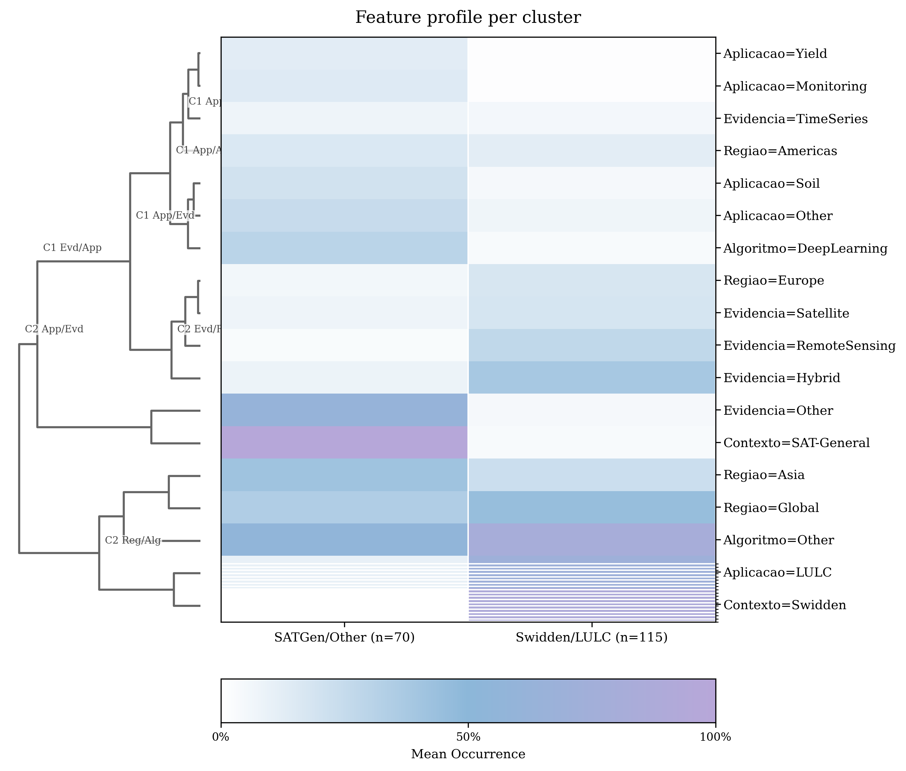{fig-align="center" width="100%"}
:::

::: {.column width="50%"}
### Diagnóstico FAIR

| Indicador | Valor |
|-----------|-------|
| Conformidade FAIR global | **18,7/100** |
| Compartilhamento de dados | **1,08%** |

- **Reprodutibilidade nula:** score 18,7 inviabiliza replicação
- **Opacidade algorítmica:** XAI inexistente em 244 estudos
- **Validação geográfica ausente** para o Semiárido

### Clusters Funcionais (k=2)

- **Cluster 1** (37,8%): DL + SAT-General + Ásia — alta complexidade, mas restrito a sensoriamento remoto
- **Cluster 2** (62,2%): Métodos convencionais + Swidden + LULC — paradigma legado, não aplicável a SAT regulatório
- Campo **bifurcado, não integrado** (silhueta=0,215; cophenético=0,89)

::: {.highlight-box}
**~~H₀~~ → H₁**

- ML em SAT tem acurácia de **89,1%**, porém:
- FAIR: **18,7/100** · apenas **12,8%** com conformidade adequada
- Código disponível: **1,08%**
- Viés de publicação: Egger **p = 0,009**
- **→ Prontidão insuficiente** para uso normativo
:::
:::
:::

---

## Cap. 2 – Resultados: Magnitudes V₁–V₈ {.smaller-text}

::: {.columns}
::: {.column width="40%"}
### Achados por Dimensão

| Dim. | lnRR | Mudança |
|------|-----:|--------:|
| **V₄ Jurídica** | −0,279 | **−24,3%** |
| **V₈ Climática** | +0,280 | **+32,3%** |
| V₅ Org. Social | +0,172 | +18,7% |
| V₁–V₃, V₆, V₇ | ≈ 0 | Variável |

::: {.highlight-box}
V₄ e V₈ são as dimensões com efeitos estatisticamente significativos e de maior magnitude.
:::
:::

::: {.column width="60%"}
{fig-align="center" width="100%"}
:::
:::

---

## Cap. 2 – Resultados: Moderadores Regionais {.smaller-text}

::: {.columns}
::: {.column width="55%"}
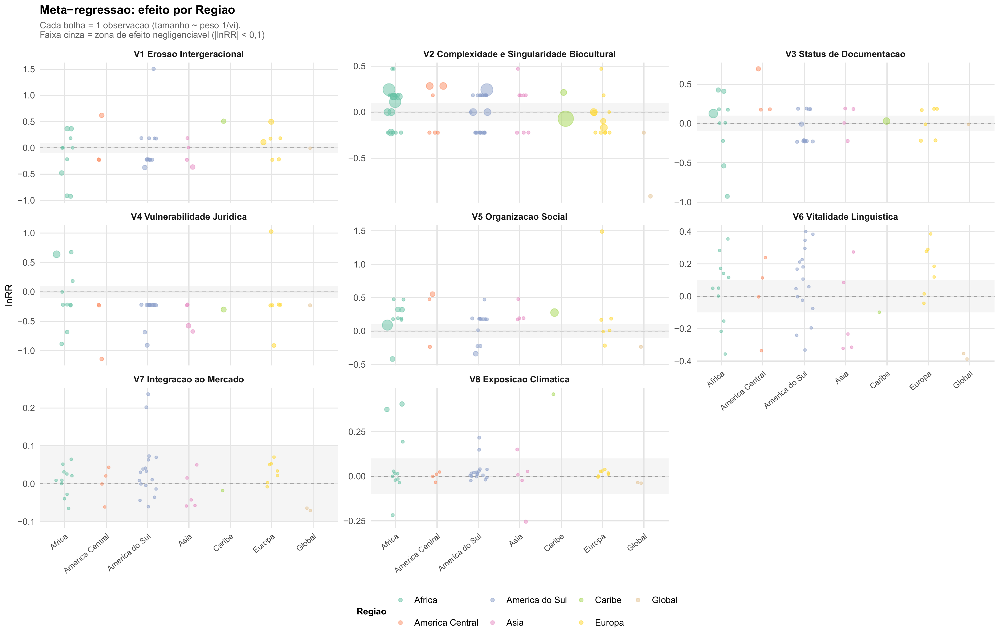{fig-align="center" width="100%"}
:::

::: {.column width="45%"}
### Padrões Regionais

- **América do Sul:** maior fragilidade jurídica (**37,1%**)
- **África Subsaariana:** erosão intergeracional acentuada
- **Sul/Sudeste Asiático:** vulnerabilidade climática elevada

::: {.highlight-box}
**Florestas sagradas** apresentam proteção máxima (β = +1,5) – governança comunitária como fator protetor.
:::
:::
:::

---

## Cap. 2 – Resultados: Intervenções e Síntese {.smaller-text}

::: {.columns}
::: {.column width="55%"}
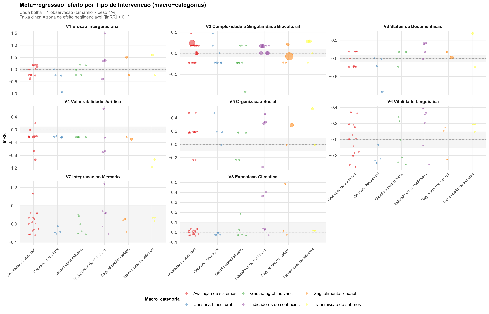{fig-align="center" width="100%"}
:::

::: {.column width="45%"}
### Tríade de Ação

1. **Reforço jurídico-fundiário** – mitigar erosão V₄
2. **Governança comunitária** – fortalecer organização social V₅
3. **Adaptação climática** – reduzir exposição V₈

::: {.highlight-box}
**~~H₀~~ → H₁**

- **→ Pelo menos uma dimensão difere em magnitude**
- V₄ (Jurídica): erosão de **24,3%**
- V₈ (Climática): incremento de **32,3%**
- Ambas com efeito estatisticamente significativo

:::
:::
:::

---

## Cap. 3 – Resultados Parciais {.smaller-text}

::: {.columns}
::: {.column width="50%"}
### Adaptação Transcultural

- Beaton – etapas 1–4 de 6
- **IVC ≥ 0,90** · Kappa ≥ 0,75
- 5 comunidades contatadas
- Versão: **WOCAT-SLM-QBR**

### Delphi

- 10–15 especialistas · 3 rodadas
- **W Kendall ≥ 0,70** · CVC ≥ 0,80
:::

::: {.column width="50%"}
### Progresso

- ✅ CVC validado pelo comitê
- ⏳ Pré-teste quilombola
- ⏳ Rodadas Delphi

::: {.highlight-box}
**Resultado esperado:** consenso superior (W Kendall ≥ 0,70; CVC ≥ 0,80) vs. instrumentos não adaptados.

**A testar: 3ª Hipótese**
:::
:::
:::

---

## Cap. 4 – Resultados Parciais {.smaller-text}

::: {.columns}
::: {.column width="50%"}
### Desenho Proposto

- TRI (Crédito Parcial): limiares δᵢₖ → escores latentes θₙ
- Fuzzy Mamdani: pertinência híbrida (meta-análise + Delphi)

| Nível | Descrição | Escala |
|:-----:|-----------|:------:|
| 1 | Consolidado | 0–20 |
| 2 | Monitoramento | 20–40 |
| 3 | Atenção | 40–60 |
| 4 | Alto | 60–80 |
| 5 | Crítico | 80–100 |

*Escala definida a priori – calibração pendente*
:::

::: {.column width="50%"}
### Progresso

- ⏳ Definição das regras fuzzy
- ⏳ Calibração TRI com dados de campo
- ⏳ Validação cruzada comunitária

::: {.highlight-box}
**Resultado esperado:** ISB fuzzy com menor RMSE vs. métodos lineares, capturando não-linearidades na percepção comunitária.

**A testar: 4ª Hipótese**
:::
:::
:::

---

## Cap. 5 – Resultados Parciais {.smaller-text}

::: {.columns}
::: {.column width="50%"}
### Métricas-Alvo

| Módulo | Métrica | Meta |
|--------|---------|------|
| BN | P(Cᵢ│e) | ≥ 0,85 |
| NLP/SBERT | σ̄ | ≥ 0,80 |
| DLT | FAIR | ≥ 80% |

### Instâncias de Auditoria

IPHAN · INPI · CGen · FAO-GIAHS

Piloto: 3–5 dossiês quilombolas
:::

::: {.column width="50%"}
### Progresso

- ⏳ Definição da ontologia normativa
- ⏳ Treinamento SBERT
- ⏳ Integração DLT

::: {.highlight-box}
**Resultado esperado:** auditoria automatizada com padronização e rastreabilidade superiores à verificação manual.

**A testar: 5ª Hipótese**
:::
:::
:::

---

## [Síntese e Contribuições]{.section-header}

---

## Implicações e Próximas Etapas {.smaller-text}

::: {.columns}
::: {.column width="50%"}
### Com base nos resultados (Caps. 1–3)

::: {.highlight-box}
1. ML: acurácia corrigida (89,1%), mas governança de dados impede uso regulatório (FAIR: 18,7/100)
2. V₄ (Jurídica) e V₈ (Climática) são prioridades de intervenção
3. WOCAT-SLM-QBR em validação transcultural (CVC concluído)
:::
:::

::: {.column width="50%"}
### Próximas etapas (Caps. 4–6)

::: {.info-box}
- Calibração TRI + Fuzzy → ISB com dados de campo
- Auditoria computacional dos dossiês gerados
- Validação territorial com as comunidades
- Avaliação de adoção (6–12 meses)
:::
:::
:::

---

## {.smaller-text}

::: {style="text-align: center; padding-top: 100px;"}

### Obrigada!

**Catuxe Varjão de Santana Oliveira**

Programa de Pós-Graduação em Ciência da Propriedade Intelectual – PPGPI/UFS

Orientador: XXXX
Coorientador: Prof. Dr. Luiz Diego Vidal Santos

:::
