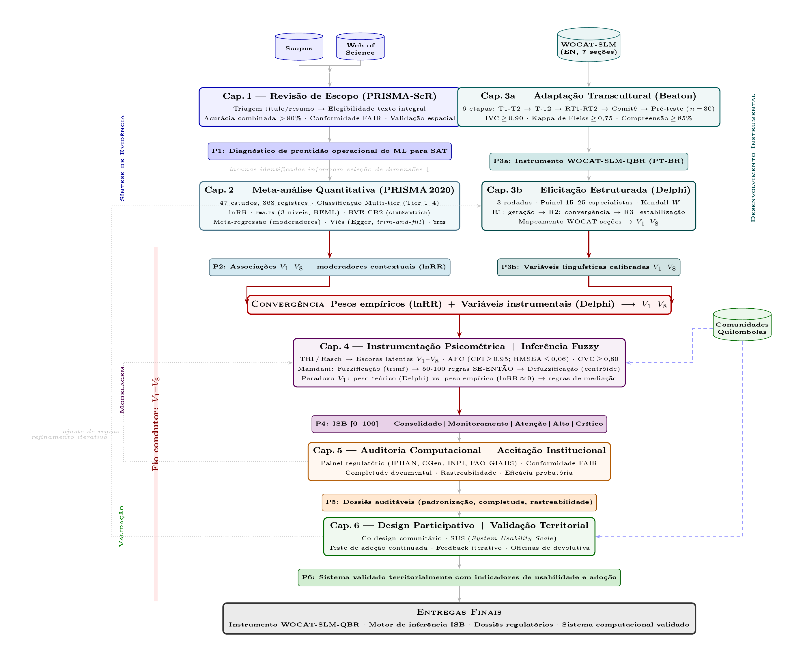
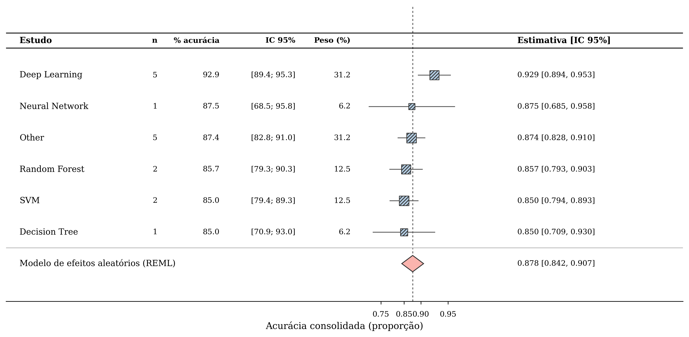
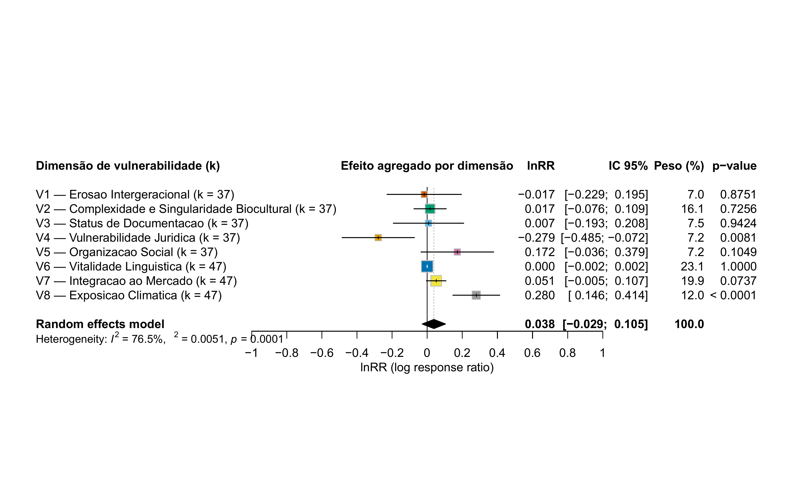

# O Problema

## Saberes Agrícolas Tradicionais em Risco

Sistemas Agrícolas Tradicionais (SAT) constituem **ativos intangíveis** co-evoluídos entre comunidades e biomas ao longo de gerações — conhecimento tácito, práticas de manejo e crenças territoriais que sustentam agrobiodiversidade e serviços ecossistêmicos.

\bigskip

**Problema central:** esses saberes são invisíveis às métricas formais, subprecificados e vulneráveis à apropriação indevida por assimetria informacional.

\bigskip

> **Lacuna:** Inexiste modelo computacional integrado capaz de transformar dados bioculturais em dossiês juridicamente válidos para salvaguarda de SAT como ativos intangíveis.

## Onde e Com Quem

:::::::::::::: {.columns}
::: {.column width="55%"}

- **11 comunidades quilombolas** — Jeremoabo, Bahia
- Semiárido Nordeste II, bioma Caatinga
- Agricultura familiar de sequeiro
- Saberes ancestrais de manejo sustentável da terra (MST)
- Aprovação CEP-CAAE: 23853219.4.0000.5546

:::
::: {.column width="45%"}

{width=95%}

:::
::::::::::::::

# Objetivos e Arquitetura

## Objetivo Geral

\begin{alertblock}{Objetivo}
Desenvolver e validar modelo integrado de decodificação e salvaguarda, articulando Machine Learning, lógica fuzzy e modelagem psicométrica, para documentar e proteger ativos intangíveis em SAT de comunidades quilombolas do Semiárido Nordeste II.
\end{alertblock}

\bigskip

**6 Objetivos Específicos (OE1–OE6):**

| OE  | Foco                                       | Método               |
|:---:|:-------------------------------------------|:---------------------|
| OE1 | Prontidão de ML para SAT                   | Revisão PRISMA-ScR   |
| OE2 | Vulnerabilidade biocultural (8 dimensões)  | Meta-análise 3 níveis|
| OE3 | Conversão tácito $\to$ computacional       | WOCAT + Delphi       |
| OE4 | Índice ISB de salvaguarda                  | TRI + Fuzzy          |
| OE5 | Auditoria normativa automatizada           | BN + NLP + DLT       |
| OE6 | Validação territorial e adoção             | Design participativo |

## Arquitetura Metodológica

{width=95%}

# Resultados Parciais

## Cap. 1 — ML em SAT: Acurácia Alta, Governança Nula

:::::::::::::: {.columns}
::: {.column width="48%"}

**244 estudos analisados (2010–2025)**

| Indicador             | Valor           |
|:----------------------|:----------------|
| Acurácia corrigida    | **89,1%**       |
| IC 95%                | 88,2–90,0%      |
| Heterogeneidade $I^2$ | 58%             |
| Viés (Egger)          | $p = 0{,}009$   |
| FAIR global           | **18,7/100**    |
| Código disponível     | **1,08%**       |

\begin{exampleblock}{Conclusão (H1 confirmada)}
ML tem alta acurácia, porém prontidão insuficiente para uso regulatório — governança de dados praticamente inexistente.
\end{exampleblock}

:::
::: {.column width="52%"}

{width=100%}

:::
::::::::::::::

## Cap. 2 — Vulnerabilidade Biocultural: 8 Dimensões

:::::::::::::: {.columns}
::: {.column width="45%"}

**47 estudos, 363 observações**

| Dimensão        | lnRR   | Mudança   |
|:----------------|-------:|----------:|
| **$V_4$ Jur.**  | $-$0,279 | **$-$24,3%**|
| **$V_8$ Clim.** | +0,280 | **+32,3%**|
| $V_5$ Org. Soc.  | +0,172 | +18,7%    |
| $V_1$--$V_3$, $V_6$, $V_7$ | $\approx$ 0 | Variável |

\begin{exampleblock}{Conclusão (H2 confirmada)}
$V_4$ (erosão jurídica) e $V_8$ (pressão climática) são as dimensões com efeito significativo e maior magnitude.
\end{exampleblock}

:::
::: {.column width="55%"}

{width=100%}

:::
::::::::::::::

## Cap. 3 — Adaptação Transcultural WOCAT-SLM

:::::::::::::: {.columns}
::: {.column width="50%"}

**Método de Beaton (6 etapas)**

- IVC $\geq$ 0,90; Kappa $\geq$ 0,75
- Versão adaptada: **WOCAT-SLM-QBR**
- 5 comunidades quilombolas contatadas
- CVC validado pelo comitê de especialistas

\bigskip

**Delphi em 3 rodadas**

- 10–15 especialistas
- Meta: W Kendall $\geq$ 0,70; CVC $\geq$ 0,80

:::
::: {.column width="50%"}

| Etapa              | Status |
|:-------------------|:------:|
| CVC comitê         | Concluído |
| Pré-teste          | Pendente  |
| Rodadas Delphi     | Pendente  |

\begin{exampleblock}{Em andamento (H3)}
Consenso superior esperado com WOCAT adaptado + Delphi vs. instrumentos não adaptados.
\end{exampleblock}

:::
::::::::::::::

# Próximos Passos e Contribuições

## Etapas Pendentes (Caps. 4–6)

:::::::::::::: {.columns}
::: {.column width="50%"}

**Cap. 4 — ISB (TRI + Fuzzy)**

- Calibração psicométrica com dados de campo
- Sistema de inferência Mamdani (50–100 regras)
- ISB: escala 0–100 em 5 níveis

\bigskip

**Cap. 5 — Auditoria Computacional**

- Módulo Bayesiano (conformidade estrutural)
- SBERT (verificação semântica)
- DLT (ancoragem criptográfica)
- Instâncias: IPHAN, INPI, CGen, FAO-GIAHS

:::
::: {.column width="50%"}

**Cap. 6 — Design Participativo**

- 2–3 comunidades quilombolas
- Protótipo Python/Streamlit
- Usabilidade SUS $\geq$ 70
- Adoção $\geq$ 60\% (6--12 meses)

\bigskip

\begin{alertblock}{Contribuição Central}
Primeiro modelo computacional integrado que converte saberes tácitos quilombolas em dossiês auditáveis, criptograficamente ancorados e juridicamente válidos perante IPHAN, INPI, CGen e FAO.
\end{alertblock}

:::
::::::::::::::

## {.plain}

\vfill
\begin{center}
{\Huge\color{ufsazul} Obrigada!}

\bigskip

{\large Catuxe Varjão de Santana Oliveira}

\smallskip

Programa de Pós-Graduação em Ciência da Propriedade Intelectual — PPGPI/UFS

\smallskip

{\small Coorientador: Prof.\ Dr.\ Luiz Diego Vidal Santos}
\end{center}
\vfill
