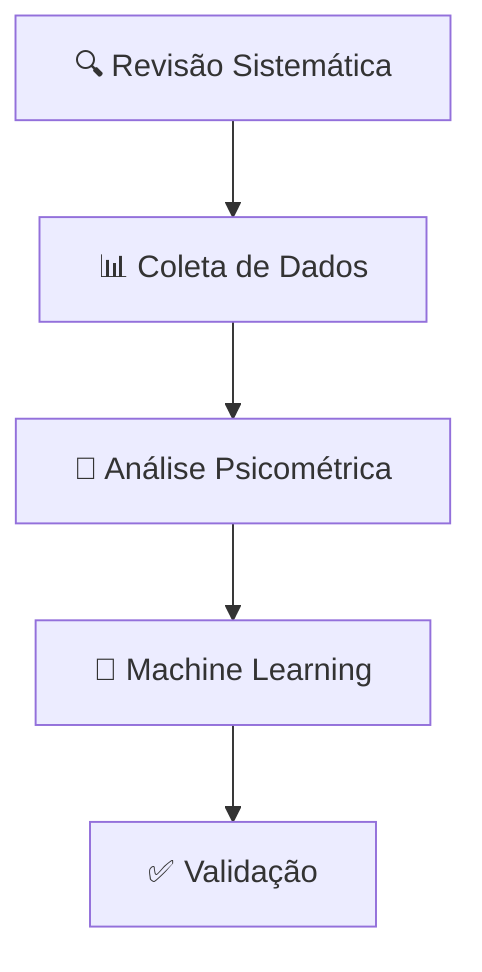
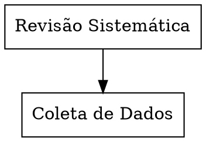
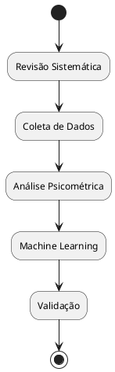
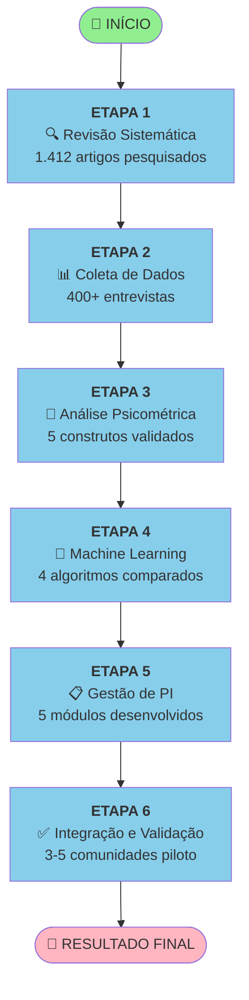
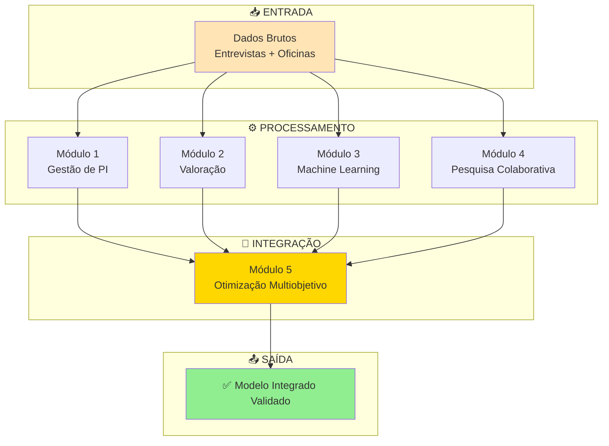
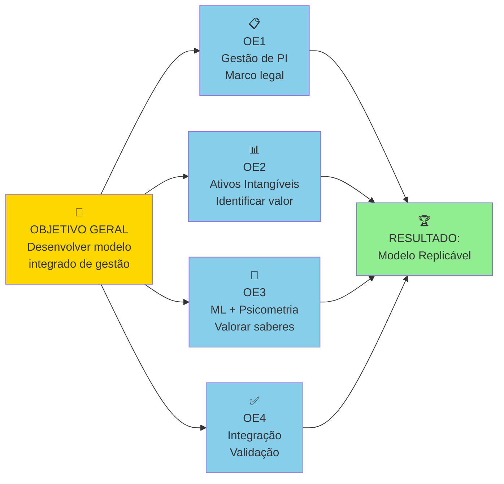

# 🎨 GUIA DE FERRAMENTAS PARA CRIAR FLUXOGRAMAS PROFISSIONAIS

## 🏆 TOP 5 MELHORES OPÇÕES

### 1. **MERMAID.JS** ⭐⭐⭐⭐⭐ (RECOMENDADO PARA NOSSO PROJETO)

**O quê é:** Linguagem de diagrama baseada em texto, renderiza em HTML/SVG

**Vantagens:**
- ✅ Integra perfeitamente com Markdown
- ✅ Código-limpo e fácil de manter
- ✅ Suporte nativo no GitHub (renderiza automaticamente)
- ✅ Versioning fácil (é texto!)
- ✅ Sem necessidade de software adicional
- ✅ Gera SVG de alta qualidade
- ✅ Exporte para PNG, SVG, PDF
- ✅ Totalmente GRATUITO

**Tipos de diagramas suportados:**
- Flowchart (fluxogramas)
- Sequence diagrams (diagramas de sequência)
- Class diagrams (diagramas de classe)
- State diagrams (diagramas de estado)
- ER diagrams (diagramas entidade-relacionamento)
- Gantt charts (gráficos de Gantt)
- Pie charts (gráficos de pizza)

**Exemplo básico:**


**Como usar:**
- Online: https://mermaid.live (editor interativo)
- No GitHub: Bloco de código com ` ```mermaid `
- No VS Code: Extensão "Markdown Preview Mermaid Support"
- No LaTeX: Pacote `mermaid.sty`

---

### 2. **GRAPHVIZ + DOT** ⭐⭐⭐⭐

**O quê é:** Linguagem de descrição de grafos (profissional, usada em ciência)

**Vantagens:**
- ✅ Renderização automática e perfeita
- ✅ Muito usado em academia/pesquisa
- ✅ Gera imagens de alta qualidade (SVG, PDF)
- ✅ Suporte em múltiplas plataformas
- ✅ Excelente para diagramas complexos

**Desvantagem:**
- ❌ Não renderiza automaticamente no GitHub (precisa gerar imagem)
- ❌ Sintaxe um pouco mais complexa

**Exemplo:**


---

### 3. **PLANTUML** ⭐⭐⭐⭐⭐

**O quê é:** Linguagem para criar diagramas UML e outros

**Vantagens:**
- ✅ Muito poderosa e flexível
- ✅ Suporte a múltiplos tipos de diagramas
- ✅ Renderização profissional
- ✅ Integração com muitas ferramentas
- ✅ Comunidade ativa

**Como usar:**
- Online: https://www.plantuml.com/plantuml/uml/
- VS Code: Extensão "PlantUML"
- Local: Instalar PlantUML

**Exemplo:**


---

### 4. **DRAW.IO / DIAGRAMS.NET** ⭐⭐⭐⭐

**O quê é:** Ferramenta visual online/desktop para criar diagramas

**Vantagens:**
- ✅ Interface visual intuitiva
- ✅ Templates prontos
- ✅ Exporta em múltiplos formatos
- ✅ Edição colaborativa
- ✅ Armazenamento em nuvem

**Desvantagens:**
- ❌ Não é baseada em código (mais difícil de versionar)
- ❌ Arquivo binário (não ideal para Git)

**Melhor para:** Prototipagem rápida e visualização

---

### 5. **TIKZ (LaTeX)** ⭐⭐⭐⭐

**O quê é:** Pacote LaTeX para criar gráficos

**Vantagens:**
- ✅ Integra perfeitamente com nosso documento LaTeX
- ✅ Qualidade profissional
- ✅ Código no mesmo documento
- ✅ Sem necessidade de arquivo externo

**Desvantagens:**
- ❌ Curva de aprendizado mais alta
- ❌ Compilação um pouco mais lenta

**Exemplo:**
```latex
\begin{tikzpicture}
    \node (A) at (0,0) {Revisão Sistemática};
    \node (B) at (0,-2) {Coleta de Dados};
    \draw [->] (A) -- (B);
\end{tikzpicture}
```

---

## 🎯 MINHA RECOMENDAÇÃO PARA NOSSO PROJETO

### **Opção Ideal: MERMAID.JS**

**Por quê?**

1. **Integração Perfeita:**
   - Renderiza automaticamente no GitHub
   - Funciona em Markdown (.md files)
   - Sem dependências externas

2. **Facilidade:**
   - Sintaxe simples e intuitiva
   - Fácil de aprender
   - Rápido para criar

3. **Profissionalismo:**
   - Gera imagens de alta qualidade
   - Múltiplos estilos disponíveis
   - Customização completa

4. **Manutenção:**
   - É texto puro (versionable)
   - Fácil de editar
   - Rápido para iterar

5. **Documentação:**
   - Já está em nossos arquivos .md
   - Coerência visual
   - Ambiente unificado

---

## 📋 ESTRATÉGIA: USAR MERMAID + EXPORTAR COMO IMAGEM

### Passo 1: Criar em Mermaid (texto puro)
```bash
CONTEUDOS/METODOLOGIA/PROCESSO/
├── fluxo-pesquisa.mmd     ← Arquivo Mermaid
├── fluxo-pesquisa.md      ← Renderiza no GitHub
└── fluxo-pesquisa.svg/png ← Exportado para uso
```

### Passo 2: Renderizar e Exportar
- Online: https://mermaid.live → Download SVG/PNG
- CLI: `npx @mermaid-js/mermaid-cli -i fluxo.mmd -o fluxo.svg`
- VS Code: Extensão + screenshot

### Passo 3: Usar em múltiplos locais
- Em Markdown (.md files) - com código Mermaid
- Em LaTeX (.tex files) - com imagem SVG/PNG
- Em GitHub - renderiza automaticamente

---

## 🛠️ COMO COMEÇAR

### Opção 1: MERMAID Online (0 instalação)
1. Abra: https://mermaid.live
2. Cole o código Mermaid
3. Veja em tempo real
4. Exporte em SVG/PNG

### Opção 2: VS Code Local (3 minutos)
1. Instale: "Markdown Preview Mermaid Support"
2. Crie arquivo `.md` com código Mermaid
3. Visualize em tempo real no Preview
4. Exporte como imagem

### Opção 3: CLI (linha de comando)
```bash
# Instalar
npm install -g @mermaid-js/mermaid-cli

# Gerar imagem
mmdc -i fluxo.mmd -o fluxo.svg

# Com tema profissional
mmdc -i fluxo.mmd -o fluxo.png -t dark
```

---

## 📊 EXEMPLOS ESPECÍFICOS PARA NOSSO PROJETO

### Exemplo 1: Fluxograma das 6 Etapas



### Exemplo 2: Os 5 Módulos Integrados



### Exemplo 3: Os 4 Objetivos Específicos



---

## 🎨 TEMAS PROFISSIONAIS PARA MERMAID

Mermaid suporta vários temas:
- `default` - Clássico profissional
- `dark` - Escuro moderno
- `forest` - Verde natural
- `neutral` - Cinza profissional

**Como usar em Markdown:**


---

## 📁 ESTRUTURA RECOMENDADA

```
CONTEUDOS/METODOLOGIA/PROCESSO/
├── README.md
├── FLUXO_PROCESSO_EXPLICADO.md
├── RESUMO_EXECUTIVO_FLUXO.md
├── DIAGRAMA_VISUAL_FLUXO.md (com código Mermaid)
├── INDICE_DOCUMENTOS_FLUXO.md
├── ATUALIZACOES_RECENTES.md
└── 📁 diagramas/                    ← NOVA
    ├── fluxo-6-etapas.md          ← Mermaid + markdown
    ├── fluxo-6-etapas.svg         ← Exportado SVG
    ├── fluxo-6-etapas.png         ← Exportado PNG
    ├── modulos-integrados.md
    ├── modulos-integrados.svg
    ├── objetivos-especificos.md
    ├── objetivos-especificos.svg
    └── [outros diagramas]
```

---

## 💡 VANTAGENS DE USAR MERMAID

| Aspecto | Benefício |
|--------|----------|
| **Rapidez** | Cria diagramas em minutos |
| **Qualidade** | Renderização profissional |
| **Versionamento** | Código puro, fácil de versionar |
| **GitHub** | Renderiza automaticamente |
| **Flexibilidade** | Use em .md ou exporte como imagem |
| **Manutenção** | Edite o texto, não a imagem |
| **LaTeX** | Exporte SVG para incluir em PDF |
| **Documentação** | Acompanhe a explicação textual |

---

## 🚀 PRÓXIMOS PASSOS

1. ✅ Escolher **MERMAID.JS** como linguagem
2. ✅ Criar pasta `CONTEUDOS/METODOLOGIA/PROCESSO/diagramas/`
3. ✅ Escrever código Mermaid para cada fluxograma
4. ✅ Testar em https://mermaid.live
5. ✅ Exportar como SVG/PNG
6. ✅ Incluir em DIAGRAMA_VISUAL_FLUXO.md
7. ✅ Usar SVG em PDF LaTeX
8. ✅ Fazer commit e push

---

## 📖 Recursos

- **Documentação Mermaid:** https://mermaid.js.org
- **Editor Online:** https://mermaid.live
- **Exemplos:** https://mermaid.js.org/ecosystem/integrations.html
- **VS Code Ext:** "Markdown Preview Mermaid Support"

---

**Recomendação Final:** Use **MERMAID.JS** - é a combinação perfeita de simplicidade, profissionalismo e integração com nosso workflow! 🎯✨
