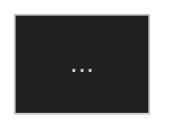

# 📊 FLUXOGRAMAS DO PROJETO - MERMAID.JS

Esta pasta contém os fluxogramas do projeto criados com **Mermaid.js**.

## 📁 Arquivos de Diagramas

### 1. `fluxo-6-etapas.md`
Fluxograma das 6 etapas principais do projeto

### 2. `modulos-integrados.md`
Diagrama dos 5 módulos e sua integração

### 3. `objetivos-especificos.md`
Estrutura dos 4 objetivos específicos

### 4. `questoes-hipoteses.md`
Alinhamento entre questões de pesquisa e hipóteses

### 5. `timeline-projeto.md`
Timeline de 36 meses do projeto

---

## 🎨 Como Usar os Diagramas

### Online (sem instalar nada)
1. Abra um arquivo `.md` (ex: `fluxo-6-etapas.md`)
2. Copie o código Mermaid
3. Cole em https://mermaid.live
4. Visualize em tempo real

### No GitHub
Os diagramas aparecem automaticamente renderizados nos arquivos `.md`

### No VS Code Local
1. Instale extensão: "Markdown Preview Mermaid Support"
2. Abra o arquivo `.md`
3. Clique em "Preview" ou "Preview to the Side"
4. Veja o diagrama renderizado

### Exportar como Imagem
```bash
# Instalar (uma única vez)
npm install -g @mermaid-js/mermaid-cli

# Gerar SVG
mmdc -i fluxo-6-etapas.md -o fluxo-6-etapas.svg

# Gerar PNG
mmdc -i fluxo-6-etapas.md -o fluxo-6-etapas.png

# Gerar com tema escuro
mmdc -i fluxo-6-etapas.md -o fluxo-6-etapas-dark.svg -t dark
```

---

## 🔗 Integração com LaTeX

Para incluir os diagramas no PDF do projeto:

```latex
% No arquivo .tex
\begin{figure}[h]
    \centering
    \includegraphics[width=0.8\textwidth]{CONTEUDOS/METODOLOGIA/PROCESSO/diagramas/fluxo-6-etapas.svg}
    \caption{Fluxograma das 6 etapas do projeto}
    \label{fig:fluxo-etapas}
\end{figure}
```

---

## 📝 Editar um Diagrama

1. Abra o arquivo `.md` em um editor
2. Modifique o código Mermaid
3. Visualize em https://mermaid.live
4. Salve as alterações
5. Commit + Push no GitHub
6. Re-exporte como imagem se necessário

---

## 🎯 Estrutura dos Arquivos Mermaid

Cada arquivo contém:
1. **Comentário explicativo** - O que o diagrama mostra
2. **Código Mermaid** - Bloqueio ```mermaid ... ```
3. **Descrição detalhada** - Explicação de cada elemento
4. **Instruções de uso** - Como aplicar

Exemplo:
```markdown
# 📊 Fluxograma das 6 Etapas

## Descrição
Este diagrama mostra o fluxo sequencial de...

## Diagrama

\`\`\`mermaid
flowchart TD
    ...código...
\`\`\`

## Descrição dos Elementos
- **Etapa 1:** ...
- **Etapa 2:** ...
```

---

## 🎨 Temas Disponíveis

Use um dos temas Mermaid:
- `default` - Profissional clássico
- `dark` - Moderno escuro
- `forest` - Verde natural
- `neutral` - Cinza profissional

Para aplicar um tema, adicione no início do diagrama:


---

## ✨ Dicas de Design

1. **Cores:** Use cores consistentes
2. **Formas:** 
   - Retângulo: processo/atividade
   - Losango: decisão
   - Oval: início/fim
   - Cilindro: dados/banco

3. **Fluxo:** Da esquerda para direita ou de cima para baixo

4. **Clareza:** Nomes descritivos e concisos

5. **Consistência:** Mantenha o mesmo estilo em todos os diagramas

---

## 🔄 Workflow Recomendado

1. **Criar** - Faça o diagrama em Mermaid
2. **Visualizar** - Teste em mermaid.live
3. **Refinar** - Ajuste cores, texto, layout
4. **Exportar** - Gere SVG/PNG para LaTeX
5. **Documentar** - Adicione explicação em texto
6. **Versionar** - Commit e push no GitHub
7. **Incluir** - Use em LaTeX ou compartilhe

---

## 📖 Recursos Rápidos

- **Documentação:** https://mermaid.js.org
- **Editor:** https://mermaid.live
- **Exemplos:** https://mermaid.js.org/syntax/flowchart.html
- **GitHub:** Renderiza automaticamente em `.md`

---

**Todos os diagramas desta pasta podem ser visualizados e editados no GitHub automaticamente!** 🚀
