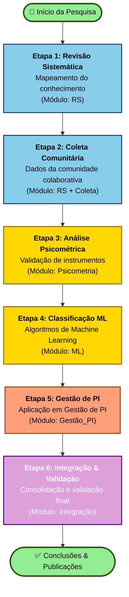
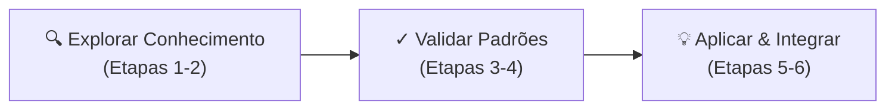
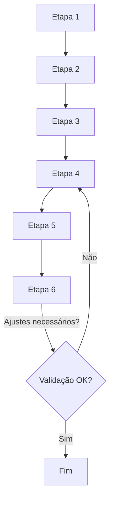

# 📊 Fluxograma das 6 Etapas Principais do Projeto

## Descrição
Este diagrama mostra o fluxo sequencial das 6 etapas principais da pesquisa, demonstrando como cada uma se conecta à próxima e como se integram com os módulos metodológicos.

## Diagrama Principal



---

## 📝 Descrição Detalhada das Etapas

### 🔵 Etapa 1: Revisão Sistemática (RS)
- **Objetivo:** Mapear o conhecimento existente sobre Gestão de PI, inovação colaborativa e absorção tecnológica
- **Atividades principais:**
  - Busca em bases de dados (Scopus, Web of Science, DOAJ)
  - Seleção e triagem de artigos
  - Análise de conteúdo qualitativo
  - Síntese do conhecimento
- **Saída:** Corpus de conhecimento validado, temas principais identificados
- **Módulo associado:** Revisão Sistemática (RS)

### 🔵 Etapa 2: Coleta Comunitária
- **Objetivo:** Coletar dados de comunidades colaborativas para complementar conhecimento teórico
- **Atividades principais:**
  - Design de instrumentos de coleta (surveys, entrevistas)
  - Recrutamento de participantes
  - Aplicação de questionários
  - Documentação de processos colaborativos
- **Saída:** Base de dados comunitária, narrativas de colaboração
- **Módulo associado:** Coleta de Dados + RS

### 🟡 Etapa 3: Análise Psicométrica
- **Objetivo:** Validar os instrumentos de medida e garantir confiabilidade dos dados
- **Atividades principais:**
  - Análise fatorial confirmatória
  - Validação de construtos
  - Teste de confiabilidade (Alpha de Cronbach)
  - Calibração de escalas
- **Saída:** Instrumentos validados, índices psicométricos
- **Módulo associado:** Análise Psicométrica (Psicometria)

### 🟡 Etapa 4: Classificação com Machine Learning
- **Objetivo:** Aplicar algoritmos de ML para classificação e predição de padrões
- **Atividades principais:**
  - Pré-processamento de dados
  - Treinamento de modelos (Random Forest, SVM, Neural Networks)
  - Validação cruzada
  - Otimização de hiperparâmetros
- **Saída:** Modelos treinados, padrões identificados, árvores de decisão
- **Módulo associado:** Machine Learning (ML)

### 🟠 Etapa 5: Gestão de Propriedade Intelectual
- **Objetivo:** Aplicar os aprendizados em gestão prática de PI
- **Atividades principais:**
  - Mapeamento de portfolios de PI
  - Aplicação de decisões de otimização Pareto
  - Estratégias de comercialização
  - Gestão colaborativa de ativos
- **Saída:** Modelos de gestão, recomendações de PI
- **Módulo associado:** Gestão de Propriedade Intelectual (Gestão_PI)

### 🟣 Etapa 6: Integração & Validação
- **Objetivo:** Integrar todos os módulos e validar o framework final
- **Atividades principais:**
  - Síntese de resultados
  - Validação com especialistas
  - Documentação de metodologia integrada
  - Preparação de publicações
- **Saída:** Framework integrado validado, artigos publicáveis
- **Módulo associado:** Integração e Validação (Integração)

---

## 🎨 Legenda de Cores

| Cor | Significado | Etapas |
|-----|-------------|--------|
| 🟢 Verde | Início/Fim | Etapas 1 e 6 |
| 🔵 Azul | Coleta de Dados | Etapas 1-2 |
| 🟡 Amarelo | Validação | Etapas 3-4 |
| 🟠 Laranja | Aplicação | Etapa 5 |
| 🟣 Roxo | Integração | Etapa 6 |

---

## 🔄 Fluxo de Dados Entre Etapas

```
Etapa 1 → Corpus de artigos
    ↓
Etapa 2 → Base de dados comunitária
    ↓
Etapa 3 → Dados validados & instrumentos
    ↓
Etapa 4 → Padrões & classificações
    ↓
Etapa 5 → Recomendações de PI
    ↓
Etapa 6 → Framework final & publicações
```

---

## ⏱️ Timeline Indicativa

| Etapa | Duração | Período |
|-------|---------|---------|
| **Etapa 1** | 4-5 meses | Meses 1-5 |
| **Etapa 2** | 4-5 meses | Meses 5-10 |
| **Etapa 3** | 3-4 meses | Meses 10-14 |
| **Etapa 4** | 4-5 meses | Meses 14-19 |
| **Etapa 5** | 4-5 meses | Meses 19-24 |
| **Etapa 6** | 12 meses | Meses 24-36 |

**Nota:** Há sobreposição entre etapas (tarefas paralelas possíveis)

---

## 🔗 Relação com Objetivos Específicos

```
Etapa 1 ──→ OE1: Conhecimento sobre Gestão de PI
Etapa 2 ──→ OE1: Perspectivas comunitárias
Etapa 3 ──→ OE2: Validação de capacidade absortiva
Etapa 4 ──→ OE3: Padrões de decisão
Etapa 5 ──→ OE4: Aplicação integrada
Etapa 6 ──→ Todos OE: Consolidação
```

---

## 📊 Variações de Diagramas

### Versão Simplificada (3 fases principais)


### Versão com Feedback (iterativa)


---

## 💾 Como Usar Este Diagrama

### 1. Visualizar no GitHub
Simplesmente abra este arquivo no GitHub e verá o diagrama renderizado.

### 2. Visualizar Localmente
- Instale extensão Mermaid no VS Code
- Abra o arquivo em preview
- Veja em tempo real

### 3. Editar
- Modifique o código Mermaid acima
- Teste em https://mermaid.live
- Salve as alterações

### 4. Exportar como Imagem
```bash
# Primeiro, instale (uma única vez)
npm install -g @mermaid-js/mermaid-cli

# Depois, exporte
mmdc -i fluxo-6-etapas.md -o fluxo-6-etapas.svg
mmdc -i fluxo-6-etapas.md -o fluxo-6-etapas.png
```

### 5. Usar em LaTeX
```latex
\begin{figure}[H]
    \centering
    \includegraphics[width=0.85\textwidth]{CONTEUDOS/METODOLOGIA/PROCESSO/diagramas/fluxo-6-etapas.svg}
    \caption{Fluxograma das seis etapas principais do projeto de pesquisa}
    \label{fig:fluxo-etapas-principais}
\end{figure}
```

---

**Criado em:** 2025
**Versão:** 1.0
**Status:** Ativo

