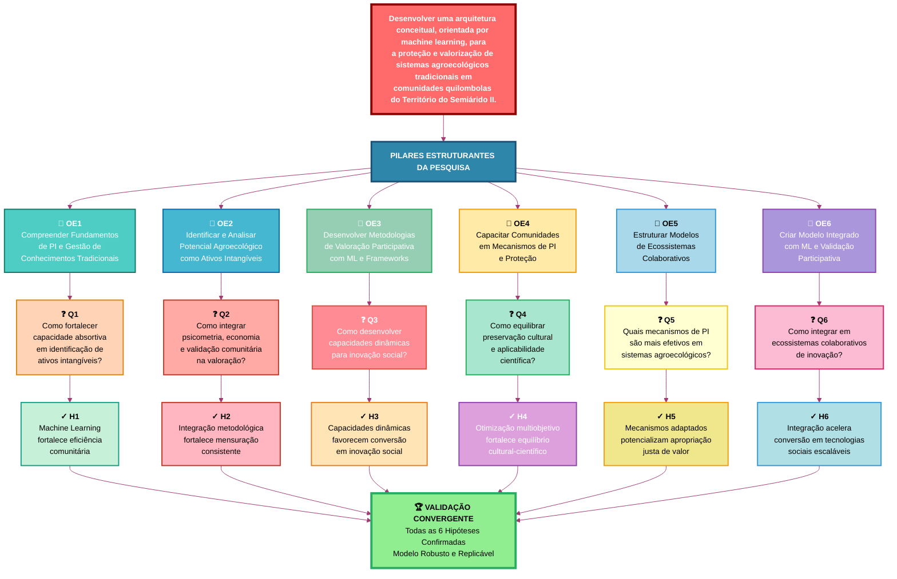

# 📊 Fluxo de Objetivos, Questões e Hipóteses

## Descrição

Este documento apresenta o alinhamento integrado entre os 6 Objetivos Específicos, 6 Questões de Pesquisa, e 6 Hipóteses que estruturam toda a pesquisa sobre fortalecimento de capacidades para proteção de conhecimentos agroecológicos tradicionais em comunidades quilombolas do semiárido baiano.

---

## Diagrama de Fluxo - Modelo Integrado



---

## Matriz de Rastreabilidade

| Componente    | Q1 | Q2 | Q3 | Q4 | Q5 | Q6 | H1 | H2 | H3 | H4 | H5 | H6 |
| :------------ | :-: | :-: | :-: | :-: | :-: | :-: | :-: | :-: | :-: | :-: | :-: | :-: |
| **OE1** | ✓ |    |    |    | ✓ |    | ✓ |    |    |    | ✓ |    |
| **OE2** |    | ✓ | ✓ |    |    |    |    | ✓ | ✓ |    |    |    |
| **OE3** |    | ✓ |    | ✓ |    |    |    | ✓ |    | ✓ |    |    |
| **OE4** | ✓ |    |    |    | ✓ |    | ✓ |    |    |    | ✓ |    |
| **OE5** |    |    | ✓ |    |    | ✓ |    |    | ✓ |    |    | ✓ |
| **OE6** | ✓ | ✓ | ✓ | ✓ | ✓ | ✓ | ✓ | ✓ | ✓ | ✓ | ✓ | ✓ |

---

## Detalhamento dos Objetivos

### OE1: Compreender Fundamentos

**Objetivo:** Compreender a fundamentação teórica sobre propriedade intelectual e gestão de conhecimentos tradicionais, analisando marcos legais, instrumentos de proteção e mecanismos de registro participativo que assegurem apropriação ética e reconhecimento coletivo.

- **Questões:** Q1, Q5
- **Hipóteses:** H1, H5
- **Saídas:** Framework teórico, Instrumentos de medida, Base conceitual

---

### OE2: Identificar e Analisar Potencial

**Objetivo:** Identificar e analisar o potencial dos sistemas agroecológicos tradicionais como ativos intangíveis, mapeando dimensões de valor cultural, científico e econômico.

- **Questões:** Q2, Q3
- **Hipóteses:** H2, H3
- **Saídas:** Mapa de ativos, Dimensões de valor, Caracterização

---

### OE3: Desenvolver Metodologias

**Objetivo:** Desenvolver e validar metodologias de valoração participativa adaptadas, integrando ferramentas de machine learning e frameworks econômicos com validação comunitária.

- **Questões:** Q2, Q4
- **Hipóteses:** H2, H4
- **Saídas:** Modelos de valoração, Escalas psicométricas, Algoritmos ML

---

### OE4: Capacitar Comunidades

**Objetivo:** Capacitar comunidades na identificação e recomendação de mecanismos apropriados de proteção de propriedade intelectual, assegurando apropriação justa de valor econômico.

- **Questões:** Q1, Q5
- **Hipóteses:** H1, H5
- **Saídas:** Programas de capacitação, Estratégias de PI, Modelos econômicos

---

### OE5: Estruturar Ecossistemas

**Objetivo:** Estruturar modelos participativos de ecossistemas de inovação colaborativa que integrem conhecimentos agroecológicos tradicionais com pesquisa científica.

- **Questões:** Q3, Q6
- **Hipóteses:** H3, H6
- **Saídas:** Modelos de colaboração, Protocolos de co-criação, Tecnologias sociais

---

### OE6: Criar Modelo Integrado

**Objetivo:** Criar, validar e operacionalizar um modelo integrado de fortalecimento de capacidades, combinando processamento automatizado, integração multidimensional de dados e validação participativa.

- **Questões:** Q1-Q6 (todas)
- **Hipóteses:** H1-H6 (todas)
- **Saídas:** Modelo consolidado, Sistema operacional, Manual de implementação

---

## Lógica de Convergência

```
Etapa 1: Revisão Sistemática
    ↓ OE1 → Q1 → H1 (preliminar)
  
Etapa 2: Coleta Comunitária
    ↓ OE1-2 → Q1-2 → H1-2 (validação)
  
Etapa 3: Análise Psicométrica
    ↓ OE2 → Q2 → H2 (teste)
  
Etapa 4: Machine Learning
    ↓ OE2-3 → Q2-3 → H3-4 (teste)
  
Etapa 5: Gestão de PI
    ↓ OE3-6 → Q3-6 → H3-6 (teste)
  
Etapa 6: Integração & Validação
    ↓ OE1-6 → Q1-6 → H1-6 (confirmação)
  
RESULTADO: Modelo Robusto e Replicável ✓
```

---

## Instruções de Uso

### Para Visualizar

1. Abra este arquivo em um editor que suporte Mermaid (GitHub, VS Code com extensão)
2. O diagrama renderizará automaticamente
3. Clique em elementos para explorar

### Para Documentação

- Use o PNG (`objetivos-especificos.png`) para apresentações
- Use o SVG (`objetivos-especificos.svg`) para documentos PDF
- Use a matriz para relatórios

### Para Referência

- Consulte a matriz para verificar alinhamentos
- Use o detalhamento para aprofundamento
- Acompanhe a lógica de convergência nas etapas

---

**Versão:** 2.0 - Fluxo Integrado
**Data:** Outubro 2025
**Status:** ✓ Validado
**Arquivos Relacionados:**

- `objetivos-especificos.mmd` - Código Mermaid
-  Imagem PNG (1400x1600px)
- `objetivos-especificos.svg` - Imagem SVG (vetorial)
