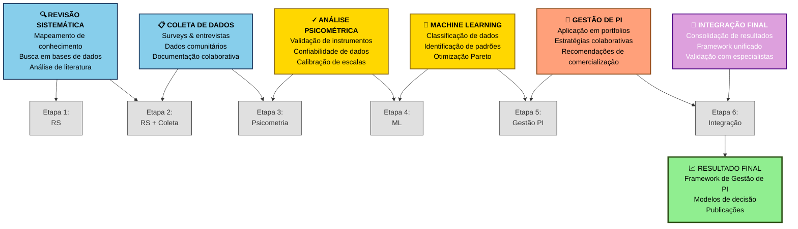
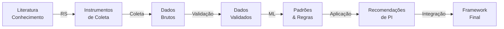

# 📊 Fluxograma dos Módulos Integrados

## Descrição

Este diagrama mostra como os 5 módulos metodológicos se integram entre si e em quais etapas cada um é aplicado.

## Diagrama Principal - Módulos & Etapas



---

## 🔵 Módulo 1: Revisão Sistemática (RS)

### Descrição

Mapeamento sistemático da literatura sobre:

- Gestão de Propriedade Intelectual
- Inovação colaborativa
- Capacidade absortiva
- Mercados de tecnologia

### Atividades Principais

1. **Busca em bases de dados**

   - Scopus, Web of Science
   - DOAJ, Google Scholar
   - Bases especializadas
2. **Triagem de artigos**

   - Critérios de inclusão/exclusão
   - Leitura de títulos e resumos
   - Análise de relevância
3. **Análise de conteúdo**

   - Extração de dados
   - Codificação temática
   - Síntese de conhecimento
4. **Mapeamento de citações**

   - Análise de redes
   - Identificação de autores-chave
   - Detecção de gaps

### Saídas

- Corpus de 200-300 artigos classificados
- Síntese temática do conhecimento
- Identificação de dimensões-chave
- Instrumentos de coleta baseados em literatura

### Ferramentas

- Mendeley, Zotero (gerenciamento)
- NVIVO, Atlas.ti (análise qualitativa)
- VOSviewer (análise de redes)

---

## 🔵 Módulo 2: Coleta de Dados Comunitários

### Descrição

Coleta de dados de comunidades colaborativas para complementar e validar conhecimento teórico.

### Atividades Principais

1. **Design de instrumentos**

   - Questionários estruturados
   - Guias de entrevista
   - Protocolos de observação
2. **Amostragem**

   - Definição de população
   - Cálculo de tamanho amostral
   - Estratégia de recrutamento
3. **Coleta de dados**

   - Aplicação de surveys online
   - Entrevistas semi-estruturadas
   - Focus groups
   - Documentação de processos
4. **Gestão de dados**

   - Banco de dados seguro
   - Backup e versionamento
   - Conformidade LGPD

### Saídas

- Base de dados com 150-200 respondentes
- Transcrições de entrevistas
- Narrativas de processos colaborativos
- Dados estruturados em formato tabular

### Ferramentas

- Qualtrics, Google Forms (surveys)
- RedCap (gestão de dados de pesquisa)
- MAXQDA (análise qualitativa)

---

## 🟡 Módulo 3: Análise Psicométrica

### Descrição

Validação dos instrumentos de medida e garantia de confiabilidade dos dados coletados.

### Atividades Principais

1. **Análise fatorial**

   - Análise Fatorial Exploratória (AFE)
   - Análise Fatorial Confirmatória (AFC)
   - Extração e rotação de fatores
2. **Validação de construtos**

   - Validade de conteúdo
   - Validade convergente
   - Validade discriminante
3. **Testes de confiabilidade**

   - Alpha de Cronbach
   - Índice de Consistência Interna
   - Confiabilidade teste-reteste
4. **Modelagem de equações estruturais**

   - Modelos de medida
   - Modelos estruturais
   - Análise de mediação/moderação

### Saídas

- Instrumentos validados
- Índices de confiabilidade > 0.70
- Relatório de validação
- Dados prontos para análise ML

### Ferramentas

- SPSS, R (análises estatísticas)
- AMOS, Lavaan (modelagem SEM)
- Mplus (análise avançada)

---

## 🟡 Módulo 4: Machine Learning

### Descrição

Aplicação de algoritmos de ML para classificação, predição e identificação de padrões nos dados.

### Atividades Principais

1. **Pré-processamento**

   - Limpeza de dados
   - Tratamento de valores faltantes
   - Normalização/Standardização
2. **Exploração de dados**

   - Estatística descritiva
   - Visualizações
   - Detecção de outliers
3. **Treinamento de modelos**

   - Random Forest
   - Support Vector Machine (SVM)
   - Redes Neurais
   - Gradient Boosting
   - Análise de Cluster
4. **Validação de modelos**

   - Validação cruzada
   - Métricas de performance
   - Otimização de hiperparâmetros
   - Teste em dados independentes
5. **Otimização Pareto**

   - Múltiplos critérios
   - Análise de trade-offs
   - Soluções não-dominadas

### Saídas

- Modelos treinados e validados
- Árvores de decisão interpretáveis
- Padrões identificados
- Recomendações de otimização
- Conjunto de soluções Pareto

### Ferramentas

- Python (scikit-learn, TensorFlow, XGBoost)
- R (caret, tidymodels)
- Jupyter Notebooks (documentação)

---

## 🟠 Módulo 5: Gestão de Propriedade Intelectual

### Descrição

Aplicação prática dos aprendizados em gestão de PI para organizações e comunidades.

### Atividades Principais

1. **Mapeamento de portfolios**

   - Inventário de ativos
   - Caracterização de PI
   - Análise de potencial comercial
2. **Modelagem de decisão**

   - Aplicação de regras extraídas
   - Simulações de cenários
   - Análise de viabilidade
3. **Estratégias colaborativas**

   - Licenciamento
   - Joint ventures
   - Spin-offs
   - Open innovation
4. **Comercialização**

   - Estratégias de go-to-market
   - Parcerias
   - Modelos de negócio

### Saídas

- Modelos de gestão para PI
- Recomendações específicas
- Planos de ação
- Métricas de impacto

### Ferramentas

- Case studies
- Workshops com especialistas
- Simulações empresariais

---

## 🟣 Integração Final

### Descrição

Consolidação de todos os módulos em um framework unificado e validado.

### Atividades Principais

1. **Síntese de resultados**

   - Consolidação de insights
   - Mapeamento de relações
   - Identificação de aplicações cruzadas
2. **Validação com especialistas**

   - Workshops de feedback
   - Revisão técnica
   - Ajustes iterativos
3. **Documentação integrada**

   - Metodologia unificada
   - Guidelines práticas
   - Casos de uso
   - Ferramentas de implementação
4. **Disseminação**

   - Publicações acadêmicas
   - Artigos em periódicos
   - Apresentações em conferências
   - Transferência de tecnologia

### Saídas

- Framework integrado (metodologia + ferramentas + casos)
- 3-5 artigos publicáveis
- Propostas de spin-offs
- Políticas de inovação recomendadas

---

## 📊 Matriz de Relação: Módulos × Etapas

```
               E1   E2   E3   E4   E5   E6
Revisão Sist.  ✓    ✓  
Coleta         ✓    ✓    ✓
Psicometria         ✓    ✓    ✓
ML                       ✓    ✓    ✓
Gestão PI                     ✓    ✓
Integração                         ✓
```

---

## 🔄 Fluxo de Dados Integrado



---

## 🎯 Dimensões do Framework Integrado

O framework final tem **3 dimensões principais**:

### 1️⃣ Dimensão de Conhecimento

- Gestão de PI (OE1, Q1)
- Inovação colaborativa
- Mercados de tecnologia
- Capacidade absortiva

### 2️⃣ Dimensão de Capacidade

- Absorção tecnológica (OE2, Q2)
- Aprendizado organizacional
- Integração de conhecimentos
- Multiobjetividade (OE3, Q3)

### 3️⃣ Dimensão de Aplicação

- Implementação prática (OE4, Q4)
- Gestão colaborativa
- Otimização de portfólios
- Sustentabilidade cultural

---

## ⏱️ Cronograma de Integração dos Módulos

| Período    | Atividades                    | Módulos Ativos     |
| ----------- | ----------------------------- | ------------------- |
| Meses 1-5   | Design e pilotagem            | RS                  |
| Meses 5-10  | Coleta principal              | RS, Coleta          |
| Meses 10-14 | Validação psicométrica     | Psico, Coleta       |
| Meses 14-19 | Análise e modelagem          | ML, Psico           |
| Meses 19-24 | Aplicação e recomendações | PI, ML              |
| Meses 24-36 | Integração e publicação   | Integração, Todos |

---

## 🚀 Características de Excelência da Integração

✅ **Coerência interna** - Todos os módulos falam a mesma linguagem
✅ **Replicabilidade** - Processos bem documentados e reproduzíveis
✅ **Inovação metodológica** - Combinação única de métodos
✅ **Aplicabilidade prática** - Resultados usáveis em organizações reais
✅ **Rigor científico** - Validação em múltiplos níveis
✅ **Escalabilidade** - Pode ser expandido e adaptado

---

## 💾 Como Usar Este Diagrama

### Visualizar

- GitHub: Vê automaticamente
- VS Code: Com extensão Mermaid

### Editar

- Modifique o código acima
- Teste em https://mermaid.live
- Salve e faça commit

### Exportar

```bash
mmdc -i modulos-integrados.md -o modulos-integrados.svg
```

### Usar em LaTeX

```latex
\begin{figure}[H]
    \centering
    \includegraphics[width=0.9\textwidth]{CONTEUDOS/METODOLOGIA/PROCESSO/diagramas/modulos-integrados.svg}
    \caption{Integração dos cinco módulos metodológicos}
    \label{fig:modulos-integrados}
\end{figure}
```

---

**Criado em:** 2025
**Versão:** 1.0
**Status:** Ativo
