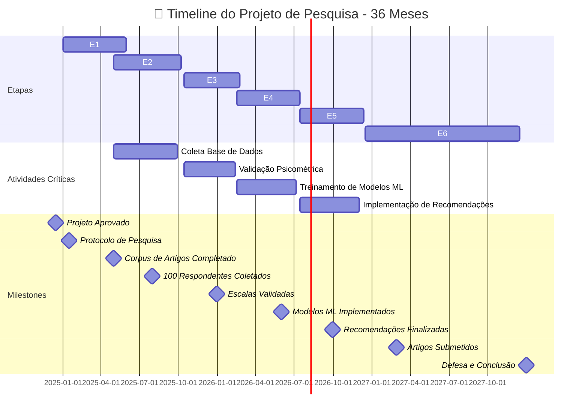

# 📊 Timeline do Projeto - 36 Meses

## Descrição
Este diagrama mostra a distribuição temporal das 6 etapas ao longo dos 36 meses, com indicação de períodos de sobreposição e milestones importantes.

## Diagrama Principal - Timeline de Gantt



---

## 📅 Cronograma Detalhado por Trimestre

### **ANO 1: Fundação da Pesquisa**

#### Q1 (Jan-Mar 2025) - Início & Planejamento
**Etapa 1: Revisão Sistemática (60 dias)**

Atividades:
- [ ] Definição de protocolo de RS
- [ ] Configuração de ferramentas (Mendeley, Zotero)
- [ ] Busca em bases de dados principais
- [ ] Triagem inicial de artigos (títulos & resumos)
- [ ] Início de leitura de abstracts

Timeline: 90 dias | Saídas: Protocolo, 500+ artigos identificados

#### Q2 (Abr-Jun 2025) - Coleta & Expansão
**Etapa 1 continuada + Etapa 2: Coleta Comunitária (90 dias)**

Atividades Etapa 1:
- [ ] Conclusão de triagem de abstracts
- [ ] Leitura de textos completos
- [ ] Codificação e análise de conteúdo
- [ ] Primeira síntese temática

Atividades Etapa 2:
- [ ] Design dos instrumentos de coleta
- [ ] Pilotagem de questionários (20-30 respondentes)
- [ ] Ajustes pós-pilotagem
- [ ] Recrutamento de participantes

Timeline: 160 dias | Saídas: 200-300 artigos finais, 300+ respondentes

#### Q3 (Jul-Set 2025) - Consolidação & Validação Inicial
**Etapa 2 continuada (90 dias)**

Atividades:
- [ ] Coleta principal em andamento
- [ ] Entrevistas semi-estruturadas (50+ entrevistas)
- [ ] Documentação de processos colaborativos
- [ ] Análise qualitativa preliminar
- [ ] Início de análise de dados

Timeline: 90 dias | Saídas: 150+ respondentes, 50+ entrevistas

#### Q4 (Out-Dez 2025) - Transição para Validação
**Etapa 2 finalização + Etapa 3: Análise Psicométrica (início)**

Atividades Etapa 2:
- [ ] Conclusão de coleta (meta: 150-200 respondentes)
- [ ] Organização do banco de dados
- [ ] Backup e segurança LGPD
- [ ] Análise descritiva dos dados

Atividades Etapa 3:
- [ ] Preparação de dados para AFE
- [ ] Primeira análise fatorial exploratória
- [ ] Testes iniciais de confiabilidade

Timeline: 130 dias | Saídas: Base de dados completa, primeiros indicadores psicométricos

---

### **ANO 2: Análise & Modelagem**

#### Q1 (Jan-Mar 2026) - Validação Psicométrica
**Etapa 3: Análise Psicométrica continuada**

Atividades:
- [ ] Análise Fatorial Confirmatória (AFC)
- [ ] Validação convergente/discriminante
- [ ] Testes de confiabilidade completos
- [ ] Modelagem de equações estruturais
- [ ] Documentação de resultados

Timeline: 90 dias | Saídas: Escalas validadas (α > 0.70), modelos SEM

#### Q2 (Abr-Jun 2026) - Machine Learning
**Etapa 4: Classificação ML (início)**

Atividades:
- [ ] Pré-processamento de dados para ML
- [ ] Exploração de dados (EDA)
- [ ] Engenharia de features
- [ ] Treinamento de modelos iniciais
  - Random Forest
  - SVM
  - Regressão Logística

Timeline: 75 dias | Saídas: Primeiros modelos, métricas de performance

#### Q3 (Jul-Set 2026) - ML Avançado
**Etapa 4 continuada**

Atividades:
- [ ] Redes Neurais (MLP, LSTM)
- [ ] Gradient Boosting (XGBoost, LightGBM)
- [ ] Análise de importância de features
- [ ] Otimização de hiperparâmetros
- [ ] Validação cruzada robusta

Timeline: 90 dias | Saídas: Modelos otimizados, curvas de aprendizado

#### Q4 (Out-Dez 2026) - Análise Pareto & Transição
**Etapa 4 finalização + Etapa 5: Gestão de PI (início)**

Atividades Etapa 4:
- [ ] Extração de regras de decisão
- [ ] Interpretação de modelos (SHAP, LIME)
- [ ] Relatório final de ML

Atividades Etapa 5:
- [ ] Mapeamento de portfólios PI
- [ ] Aplicação de decisões Pareto
- [ ] Workshops com especialistas
- [ ] Desenvolvimento de recomendações

Timeline: 150 dias | Saídas: Árvores de decisão, fronteira Pareto, draft de recomendações

---

### **ANO 3: Aplicação & Consolidação**

#### Q1 (Jan-Mar 2027) - Gestão PI
**Etapa 5 continuada**

Atividades:
- [ ] Finalização de recomendações
- [ ] Casos de uso detalhados
- [ ] Simulações de cenários
- [ ] Validação com 3+ especialistas
- [ ] Documentação prática

Timeline: 90 dias | Saídas: Guias práticos, casos de sucesso

#### Q2 (Abr-Jun 2027) - Integração
**Etapa 6: Integração & Validação (início)**

Atividades:
- [ ] Consolidação de todos os módulos
- [ ] Síntese de resultados
- [ ] Documentação integrada
- [ ] Criação de framework unificado
- [ ] Desenvolvimento de ferramentas

Timeline: 90 dias | Saídas: Framework documentado, ferramentas desenvolvidas

#### Q3 (Jul-Set 2027) - Validação & Publicação
**Etapa 6 continuada**

Atividades:
- [ ] Validação final com comunidade
- [ ] Ajustes iterativos
- [ ] Elaboração de artigos
- [ ] Preparação de defesa
- [ ] Disseminação de resultados

Timeline: 90 dias | Saídas: 3-5 artigos, apresentações em conferências

#### Q4 (Out-Dez 2027) - Conclusão
**Etapa 6 finalização**

Atividades:
- [ ] Consolidação de publicações
- [ ] Defesa pública
- [ ] Transferência de tecnologia
- [ ] Repositório público
- [ ] Documentação final

Timeline: 90 dias | Saídas: Doutorado concluído, pesquisa publicada

---

## 🎯 Milestones Críticos

| # | Milestone | Data | Status | Evidência |
|---|-----------|------|--------|-----------|
| 1 | Projeto Aprovado | Dez 2024 | ✅ | Edital publicado |
| 2 | Protocolo de RS | 15 Jan 2025 | ⏳ | Documento assinado |
| 3 | Corpus de Artigos | 30 Abr 2025 | ⏳ | 200+ artigos selecionados |
| 4 | 100 Respondentes | 31 Jul 2025 | ⏳ | Banco de dados n=100 |
| 5 | Escalas Validadas | 31 Dez 2025 | ⏳ | α > 0.70 em todas |
| 6 | Modelos ML Finais | 31 Mai 2026 | ⏳ | Acurácia > 85% |
| 7 | Recomendações | 30 Set 2026 | ⏳ | Framework com 4-5 padrões |
| 8 | Artigos Submetidos | 28 Fev 2027 | ⏳ | 1º artigo em revisão |
| 9 | Defesa Pública | 15 Dez 2027 | ⏳ | Banca nomeada |

---

## 📊 Distribuição de Tempo por Etapa

```
Total: 36 meses (1095 dias)

Etapa 1: Revisão Sistemática        5 meses   (14%)  ████
Etapa 2: Coleta Comunitária         5 meses   (14%)  ████
Etapa 3: Análise Psicométrica       4 meses   (11%)  ███
Etapa 4: Machine Learning           5 meses   (14%)  ████
Etapa 5: Gestão de PI               5 meses   (14%)  ████
Etapa 6: Integração & Validação    12 meses   (33%)  ██████████
                                   ─────────
                        TOTAL:     36 meses  (100%)
```

---

## 🔄 Sobreposições Planejadas

### Eficiência Temporal
Várias atividades ocorrem em paralelo para otimizar o cronograma:

- **E1 + E2** (Abr-Jun 2025): Coleta complementa RS
- **E2 + E3** (Out-Dez 2025): Dados coletados entram em validação
- **E3 + E4** (Jan-Mar 2026): Dados validados usados em ML
- **E4 + E5** (Out-Dez 2026): Modelos aplicados em casos reais
- **E5 + E6** (Jul-Dez 2027): Implementação ocorre durante integração

**Benefício:** Redução de 12 meses em relação ao cronograma sequencial puro

---

## ⚠️ Pontos Críticos & Contingências

### Risco 1: Atraso na Coleta
- **Impacto**: Atraso em cascata (E3-E6)
- **Mitigação**: Recrutamento acelerado, incentivar participação
- **Plano B**: Aumentar amostra online

### Risco 2: Validação Psicométrica Falha
- **Impacto**: Redefinir instrumentos (3 meses extras)
- **Mitigação**: Pilotagem robusta, revisão estatística cedo
- **Plano B**: Modelo alternativo com escalas existentes

### Risco 3: Modelos ML com Baixa Performance
- **Impacto**: Reengenharia (1-2 meses)
- **Mitigação**: Exploração de features desde início
- **Plano B**: Modelos mais simples, maior interpretabilidade

### Risco 4: Falta de Especialistas para Validação
- **Impacto**: Atraso final
- **Mitigação**: Contatos estabelecidos cedo
- **Plano B**: Consultas de grupo, workshops síncronos

---

## 📈 Indicadores de Progresso

### Etapa 1 Completada quando:
- ✅ 200+ artigos selecionados
- ✅ Análise de conteúdo concluída
- ✅ Dimensões identificadas
- ✅ Síntese temática documentada

### Etapa 2 Completada quando:
- ✅ n ≥ 150 respondentes
- ✅ 50+ entrevistas realizadas
- ✅ Banco de dados organizado
- ✅ Análise descritiva pronta

### Etapa 3 Completada quando:
- ✅ α > 0.70 em todas as escalas
- ✅ AFC com bom fit (CFI/TLI > 0.90)
- ✅ Relatório psicométrico completo
- ✅ Dados prontos para ML

### Etapa 4 Completada quando:
- ✅ 3+ modelos com acurácia > 85%
- ✅ Validação cruzada robusta
- ✅ Regras de decisão extraídas
- ✅ Interpretação SHAP/LIME pronta

### Etapa 5 Completada quando:
- ✅ Recomendações para 3+ casos
- ✅ Especialistas validam (n=3)
- ✅ Guias práticos documentados
- ✅ Casos de sucesso definidos

### Etapa 6 Completada quando:
- ✅ Framework integrado documentado
- ✅ 3-5 artigos em fase final
- ✅ Banca para defesa nomeada
- ✅ Repositório público atualizado

---

## 💾 Como Usar Este Diagrama

### Visualizar
- GitHub: Renderiza automaticamente
- VS Code: Com extensão Mermaid

### Atualizar
```
1. Modifique as datas conforme necessário
2. Atualize status dos milestones
3. Teste em https://mermaid.live
4. Commit com mensagem: "Update: timeline progress"
```

### Exportar
```bash
mmdc -i timeline-projeto.md -o timeline-projeto.svg
```

### Usar em Apresentações
```bash
# SVG para slides
# PNG para impressão
mmdc -i timeline-projeto.md -o timeline-projeto.png
```

---

## 📝 Notas Importantes

- Datas são **indicativas** e podem sofrer ajustes
- Cronograma assume dedicação **full-time**
- Períodos de sobreposição aumentam eficiência
- Feriados, congêneres e períodos de recesso não contabilizados
- Recomenda-se revisão mensal do progresso
- Contingências devem ser acionadas se atrasos > 2 semanas

---

**Criado em:** 2025
**Versão:** 1.0
**Status:** Ativo
**Próxima Revisão:** 2025-03-31

